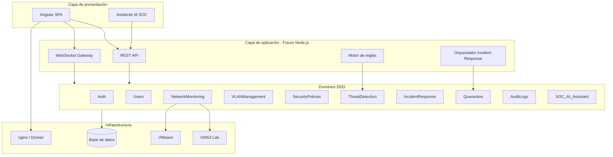
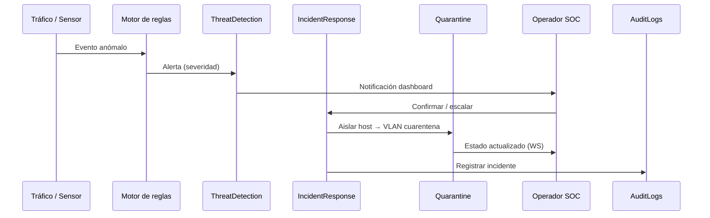

# Arquitectura del sistema — NetGuard SOC

## Visión general

NetGuard SOC es una plataforma de **monitoreo de red y ciberseguridad** orientada a operaciones SOC/NOC: visualización de infraestructura, gestión de VLANs, detección de amenazas, aislamiento en cuarentena y respuesta a incidentes.

---

## Estado actual vs futuro

| Capa | Actual | Futuro |
|------|--------|--------|
| Presentación | Angular 21 SPA | Misma base + PWA opcional |
| API | Servicios mock en `core/services/` | Node.js + Express/Fastify + OpenAPI |
| Tiempo real | `socket.io-client` preparado | Gateway WebSocket + eventos SOC |
| Datos | Memoria / localStorage (auth) | PostgreSQL o MongoDB + Redis cache |
| Red lab | Mock (`mock-network.service`) | GNS3 API + VMware vSphere |
| Calidad | Vitest + CI GitHub Actions | SonarQube en pipeline |
| IA | `soc-ai.service` (mock/reglas) | LLM o API externa con contexto SOC |

---

## Diagrama de capas



---

## Frontend Angular (estado actual)

### Estructura relevante

```
src/app/
├── core/           # Servicios, guards, modelos, interceptors
├── layouts/        # main-layout (shell SOC/NOC)
├── pages/          # Módulos por ruta lazy-loaded
└── shared/         # Componentes reutilizables (KPI, modal, SOC AI)
```

### Rutas principales

| Ruta | Módulo / dominio |
|------|------------------|
| `/login` | Auth |
| `/vision-general` | NetworkMonitoring |
| `/dispositivos` | NetworkMonitoring |
| `/alertas` | ThreatDetection |
| `/vlans` | VLANManagement |
| `/vlan-cuarentena` | Quarantine |
| `/topologia` | NetworkMonitoring |
| `/simulacion-ataques` | ThreatDetection |
| `/politicas` | SecurityPolicies |
| `/auditoria` | AuditLogs |
| `/configuracion` | Users / sistema |
| `/reportes` | AuditLogs / exportación |

### Seguridad en cliente

- `authGuard`, `noAuthGuard`, `roleGuard`
- `token-interceptor` (preparado para JWT del backend futuro)
- Roles: `admin`, `operador`, `analista` con permisos diferenciados

---

## Backend Node.js (futuro)

Responsabilidades planificadas:

- Autenticación JWT + refresh tokens
- CRUD de VLANs, políticas, dispositivos
- Ingesta de eventos de red y correlación
- WebSocket: alertas, cambios de topología, estado de cuarentena
- Integración con motor de reglas y cola de incidentes

Referencia de contrato: [implementacion/openapi-angular-backend-node.yaml](./implementacion/openapi-angular-backend-node.yaml)

---

## Servicios de monitoreo

| Servicio (actual / futuro) | Función |
|----------------------------|---------|
| `mock-network.service` | Datos simulados de red (actual) |
| `network-api.service` | Abstracción hacia API real (futuro) |
| `soc-event.service` | Eventos SOC unificados |
| `soc-integration.service` | Puente con sistemas externos |
| `attack-simulation.service` | Escenarios de ataque en laboratorio |

---

## Motor de reglas (futuro)

Evalúa tráfico, logs y telemetría contra **SecurityPolicies**:

1. Matching de condiciones (IP, puerto, VLAN, firma)
2. Generación de alerta con severidad
3. Disparo de acciones: notificar, auditar, **aislar en Quarantine**

En el frontend actual, parte de esta lógica vive en `security-policy.service` de forma simplificada.

---

## Asistente IA SOC

- Componente: `soc-ai-assistant`
- Servicio: `soc-ai.service`
- **Actual**: respuestas basadas en contexto mock y plantillas
- **Futuro**: contexto enriquecido con alertas activas, políticas violadas y estado de VLANs vía API

---

## Flujo de detección y cuarentena



---

## Integraciones planificadas

| Tecnología | Uso |
|------------|-----|
| **GNS3** | Topología de laboratorio, simulación de ataques |
| **VMware** | VMs de sensores y endpoints de prueba |
| **Docker** | Frontend nginx; futuros microservicios |
| **SonarQube** | Calidad y deuda técnica |
| **WebSockets** | Alertas y KPIs en tiempo real |

Ver: [implementacion/](./implementacion/)

---

## Principios arquitectónicos

1. **Separación de dominios** — cada bounded context con modelos y servicios propios
2. **Fail-safe en cuarentena** — preferir aislamiento antes que exposición prolongada
3. **Auditoría obligatoria** — acciones críticas siempre en AuditLogs
4. **API-first** — contrato OpenAPI antes de acoplar UI
5. **Observabilidad** — métricas, logs y trazas desde diseño (ver [monitoring.md](./monitoring.md))
