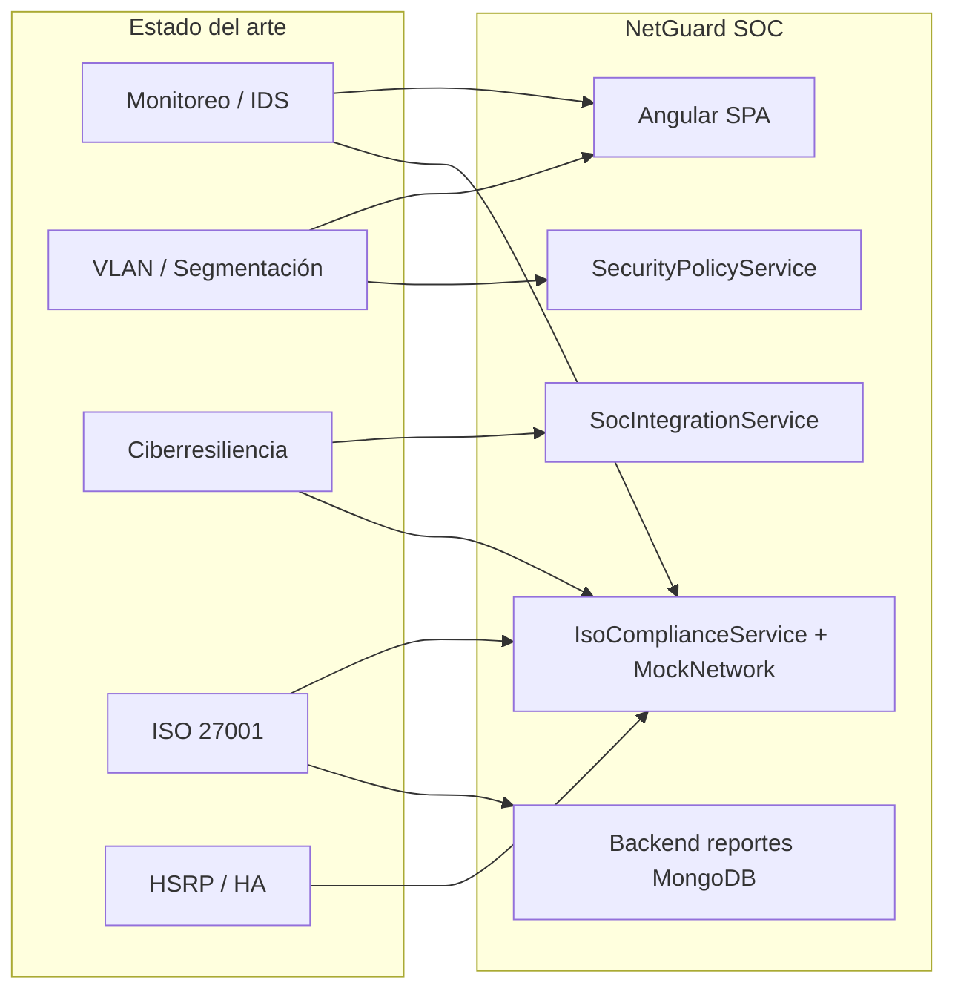

# Estado del arte aplicado — NetGuard SOC / NetWatch Pro

Esta carpeta documenta **qué conceptos de los estados del arte revisados en la tesis están implementados (o planificados) en el software**, y **cómo se materializan** en pantallas, servicios, modelos y backend.

Los artículos originales (resúmenes y análisis crítico) permanecen en [`../estado_del_arte/`](../estado_del_arte/).

---

## Propósito

| Carpeta | Rol |
|---------|-----|
| [`estado_del_arte/`](../estado_del_arte/) | Revisión bibliográfica: qué dicen los autores, métricas, críticas |
| **`estado_arte_aplicado/`** (esta carpeta) | Trazabilidad ingeniería: qué se tomó de esa literatura y cómo quedó en el código |

Complementa la matriz de operacionalización en [`../matriz-operacionalizacion/`](../matriz-operacionalizacion/), que mapea dimensiones 1–15 de la tesis con rutas y servicios.

---

## Leyenda de estado de implementación

| Estado | Significado |
|--------|-------------|
| **Implementado** | Funcionalidad operativa en el repositorio (puede usar datos mock o simulación) |
| **Parcial** | Concepto presente de forma simplificada, reglas en lugar de ML, o solo en UI |
| **Referenciado** | Inspira diseño o documentación; no hay módulo dedicado aún |
| **Futuro** | Descrito en arquitectura, OpenAPI o roadmap; pendiente de desarrollo |

---

## Índice por temática

| Documento | Artículos en `estado_del_arte/` | Conceptos principales en el software |
|-----------|--------------------------------|--------------------------------------|
| [monitoreo.md](./monitoreo.md) | Monitoreo #1–#9 (9) | IDS/NIDS, alertas, simulación de ataques, KPIs SOC |
| [vlan_segmentacion.md](./vlan_segmentacion.md) | VLAN y Segmentación #1–#9 (9) | VLANs institucionales, inter-VLAN, cuarentena, políticas |
| [ciberresiliencia.md](./ciberresiliencia.md) | Ciberresiliencia #1–#16 (16) | Resiliencia, Zero Trust, IR, cuarentena, CTI, confianza |
| [iso27001.md](./iso27001.md) | ISO27001 #1–#5 (5) | SGSI, Anexo A, riesgos, cumplimiento, reportes PDF |
| [hsrp_redundancia.md](./hsrp_redundancia.md) | HSRP, GLBP y Redundancia #1–#6 (6) | Gateways HSRP, failover, RTO, alta disponibilidad |

**Total:** 45 artículos documentados → agrupados en 5 líneas temáticas alineadas con la tesis.

---

## Vista transversal del software

---

## Rutas del código más citadas

| Área | Rutas principales |
|------|-------------------|
| Constantes y matriz tesis | `frontend/src/app/core/constants/iso.constants.ts` |
| Cumplimiento y KPIs agregados | `frontend/src/app/core/services/iso-compliance.service.ts` |
| Red simulada (VLAN, alertas, topología) | `frontend/src/app/core/services/mock-network.service.ts` |
| Políticas y motor IDS/IPS simplificado | `frontend/src/app/core/services/security-policy.service.ts` |
| Integración alerta → cuarentena | `frontend/src/app/core/services/soc-integration.service.ts` |
| Simulación de ataques | `frontend/src/app/core/services/attack-simulation.service.ts` |
| Reportes e ISO en backend | `backend/src/models/report.model.ts`, `backend/src/routes/report.routes.ts` |
| Asistente IA SOC | `frontend/src/app/core/services/soc-ai.service.ts` |

---

## Relación con otra documentación

| Documento | Relación |
|-----------|----------|
| [../matriz-operacionalizacion/mapeo_dimensiones_variables.md](../matriz-operacionalizacion/mapeo_dimensiones_variables.md) | Mapeo académico dimensiones 1–15 ↔ código |
| [../arquitectura.md](../arquitectura.md) | Capas, dominios DDD y roadmap |
| [../incident_response.md](../incident_response.md) | Flujo operativo ante intrusos |
| [../implementacion/](../implementacion/) | OpenAPI, WebSockets, GNS3, VMware |

---

## Mantenimiento

Al implementar una funcionalidad inspirada en un artículo del estado del arte:

1. Actualizar el documento temático correspondiente en esta carpeta.
2. Si afecta la matriz de la tesis, actualizar [`mapeo_dimensiones_variables.md`](../matriz-operacionalizacion/mapeo_dimensiones_variables.md).
3. Registrar el avance en [`../avances/`](../avances/) si cierra una fase.
