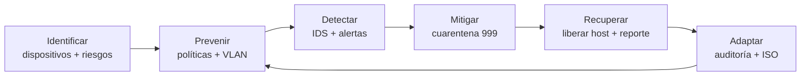

# Ciberresiliencia — Estado del arte aplicado

Artículos fuente: [`Ciberresiliencia#1`](../estado_del_arte/Ciberresiliencia%231.md) a [`Ciberresiliencia#16`](../estado_del_arte/Ciberresiliencia%2316.md).

La literatura define ciberresiliencia como la capacidad de **anticipar, resistir, recuperarse y adaptarse** ante ciberataques. Los artículos cubren Zero Trust, micro-segmentación, fases identify-prevent-detect-mitigate-recover, CTI, frameworks para PYMEs y factores humanos.

NetGuard SOC materializa estos conceptos mediante **arquitectura de red resiliente + operaciones SOC** (detección, contención, recuperación, auditoría) y el indicador compuesto de **confianza institucional**.

---

## Resumen de adopción

| # | Artículo (abreviado) | Estado | Concepto adoptado |
|---|----------------------|--------|-------------------|
| 1 | Zero Trust IIoT | Parcial | Sin confianza implícita; RBAC; micro-segmentación VLAN |
| 2 | Malware analysis SMEs | Parcial | Detección y respuesta; simulación de malware |
| 3 | Cyber resilience operationalization SMEs | **Implementado** | Matriz operacionalización + módulos SOC |
| 4 | Cyber-resilience CPS survey | Referenciado | Marco teórico; CPS no es el dominio del software |
| 5 | CPS resilience models | Referenciado | Modelos de resiliencia en `iso.models.ts` |
| 6 | Smart grid cyber-resiliency | Referenciado | Fases resilientes como referencia de diseño |
| 7 | RL feedback cyber resilience | Futuro | Asistente IA SOC como evolución |
| 8 | Survey cyber resilience strategies | **Implementado** | KPIs resiliencia, SPOF, disponibilidad |
| 9 | Human factors healthcare | Parcial | RBAC, auditoría de usuarios, manual de usuario |
| 10 | SMEs Portugal ISMS | Parcial | Gestión SGSI simplificada (ISO 27001 en UI) |
| 11 | Power systems resilience | Referenciado | Fuera del alcance del dominio educativo |
| 12 | Human factors cybersecurity | Parcial | Roles, permisos, trazabilidad en auditoría |
| 13 | Blockchain supply chain | Referenciado | No implementado |
| 14 | Financial institutions resilience | Parcial | Indicador de confianza institucional |
| 15 | CTI for organizational resilience | Parcial | Alertas, inteligencia de amenazas en políticas (A.5.7) |
| 16 | Digital transformation challenges | Parcial | Documentación DevOps, CI, calidad ISO 25000 |

---

## Pilares de ciberresiliencia en el software

### Fase 1 — Identificación y prevención

**Inspiración:** #3, #8, #10 — inventario, políticas, conciencia de riesgo.

| Capacidad | Implementación |
|-----------|----------------|
| Inventario de activos | `pages/dispositivos/`, control A.8.1 |
| Políticas de seguridad | `pages/politicas/`, `security-policy.service.ts` |
| Evaluación de riesgos | `IsoComplianceService.riesgos`, `pages/reportes/` |
| Checklist controles ISO | `CONTROLES_ISO_27001` en `iso.constants.ts` |

---

### Fase 2 — Detección

**Inspiración:** #1, #2, #15 — monitoreo continuo, CTI, detección de amenazas.

| Capacidad | Implementación |
|-----------|----------------|
| IDS / alertas | `pages/alertas/`, `mock-network.service.ts` |
| Vulnerabilidades derivadas | `IsoComplianceService.vulnerabilidades` |
| Simulación de ataques | `pages/simulacion-ataques/` |
| Inteligencia de amenazas (A.5.7) | Políticas y contexto del asistente SOC |

---

### Fase 3 — Mitigación y contención

**Inspiración:** #1 (micro-segmentación), #2 (response), Zero Trust.

| Capacidad | Implementación |
|-----------|----------------|
| Cuarentena VLAN 999 | `pages/vlan-cuarentena/`, `soc-integration.service.ts` |
| Política cuarentena automática | `security-policy.service.ts` |
| Bloqueo inter-VLAN | `POLITICAS_TRAFICO_VLAN` |
| Fail-safe | Preferir aislamiento antes que exposición (`arquitectura.md`) |

```typescript
// soc-integration.service.ts — flujo de contención
// Evalúa políticas → mueve intruso a VLAN 999 → emite evento AUTO + notificación
```

---

### Fase 4 — Recuperación y adaptación

**Inspiración:** #6, #8 — recuperación tras incidente, continuidad.

| Capacidad | Implementación |
|-----------|----------------|
| Liberar de cuarentena | `vlan-cuarentena` — acción manual del operador |
| Eventos de disponibilidad | `IsoComplianceService.eventosDisponibilidad` |
| Failover gateway HSRP | Ver [hsrp_redundancia.md](./hsrp_redundancia.md) |
| Reportes de incidente | Backend MongoDB + exportación PDF |
| Plan de respuesta (A.5.24, A.5.26) | Formulario en `pages/reportes/` |

---

### Fase 5 — Aprendizaje y mejora continua

**Inspiración:** #3, #10, #12 — evaluación de desempeño, factores humanos.

| Capacidad | Implementación |
|-----------|----------------|
| Auditoría de acciones | `audit-trail.service.ts`, `pages/auditoria/` |
| Logs unificados SOC | `soc-event.service.ts` |
| Indicador confianza institucional | `IsoComplianceService.confianzaInstitucional` |
| Métricas ISO 25000 | `pages/configuracion/` pestaña calidad-iso |

**Fórmula de confianza (dim. 15):**

- Disponibilidad red 25 %
- Disponibilidad software 20 %
- Cumplimiento ISO 35 %
- Resolución de incidentes 20 %

---

## Zero Trust y micro-segmentación (artículo #1)

El software no despliega Nebula/WireGuard ni certificados por nodo, pero aplica **principios Zero Trust de diseño**:

| Principio Zero Trust | Cómo aparece en NetGuard SOC |
|---------------------|------------------------------|
| Nunca confiar, siempre verificar | RBAC por rol; rutas protegidas con `authGuard` / `roleGuard` |
| Micro-segmentación | VLANs por área + matriz inter-VLAN |
| Monitoreo continuo | Dashboard SOC, alertas, auditoría |
| Respuesta automatizada | Políticas → cuarentena sin intervención manual |

---

## Resiliencia de infraestructura (artículos #5, #8)

| Métrica | Ubicación |
|---------|-----------|
| Índice de resiliencia % | `IsoComplianceService.resiliencia` |
| Puntos únicos de fallo (SPOF) | `iso.models.ts` → `PuntoUnicoFallo`; panel en dashboard |
| Equipos redundantes | Dispositivos RT-CORE-01/02, SW-DIST-01/02 en mock |
| Balanceo de carga (indicador) | `ResilienciaInfraestructura.balanceoCargaActivo` |

---

## Ciclo de resiliencia implementado



---

## Lo que no está implementado

| Concepto | Estado |
|----------|--------|
| Blockchain para trazabilidad | Referenciado (#13) |
| Reinforcement Learning adaptativo | Futuro (#7) |
| CTI feeds externos (STIX/TAXII) | Futuro |
| Framework completo NIST CSF automatizado | Parcial (controles ISO seleccionados) |

---

## Cómo demostrar en la tesis

1. **Dashboard** → índice resiliencia, SPOF, confianza institucional.
2. **Simular ataque** → **alerta** → **cuarentena automática** → **auditoría**.
3. **Reportes** → incidente con tratamiento de riesgo y control ISO.
4. Vincular con variable independiente «Arquitectura de Red Ciberresiliente» y dependiente «Postura de Ciberseguridad».
