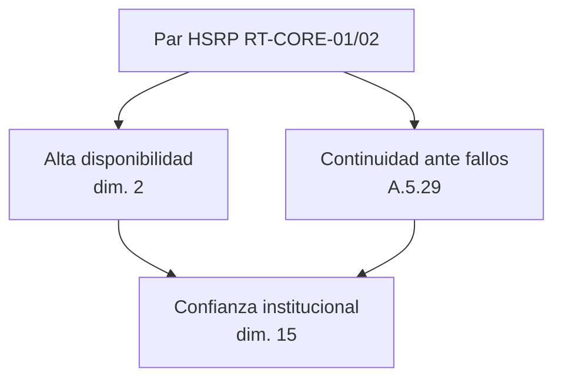

# HSRP, GLBP y redundancia — Estado del arte aplicado

Artículos fuente: [`HSRP, GLBP y Redundancia #1`](../estado_del_arte/HSRP,%20GLBP%20y%20Redundancia%20%231.md) a [`HSRP, GLBP y Redundancia #6`](../estado_del_arte/HSRP,%20GLBP%20y%20Redundancia%20%236.md).

La literatura evalúa protocolos **First Hop Redundancy (FHRP)**: HSRP, VRRP y GLBP, con métricas de failover time, uptime, packet loss, latency y jitter en topologías enterprise y campus universitario.

NetGuard SOC implementa **alta disponibilidad de gateway con HSRP** en la capa de simulación y KPIs, como parte de la variable independiente «Arquitectura de Red Ciberresiliente» (dimensión 2).

---

## Resumen de adopción

| # | Artículo (abreviado) | Estado | Concepto adoptado |
|---|----------------------|--------|-------------------|
| 1 | HSRP y VRRP enterprise (Packet Tracer) | **Implementado** | Gateway activo/respaldo, failover &lt; 5 s |
| 2 | FHRP VRRP/HSRP/GLBP + BGP/EIGRP | Parcial | HSRP modelado; BGP/EIGRP no en UI |
| 3 | DMVPN + HSRP secured enterprise | Referenciado | VPN no implementada |
| 4 | Performance evaluation FHRP | **Implementado** | Métricas RTO, uptime, eventos failover |
| 5 | VLAN + HSRP distributed routing | **Implementado** | Integración VLAN + gateways redundantes |
| 6 | Virtual university network HSRP | **Implementado** | Contexto institución educativa |

---

## Cómo se implementa en el software

### 1. Gateways HSRP activo y respaldo

**Inspiración:** #1, #4, #6 — routers core redundantes con IP virtual.

**Implementación:**

| Elemento | Ubicación |
|----------|-----------|
| Modelo `GatewayHA` | `iso.models.ts` — `protocolo: 'HSRP' \| 'VRRP' \| 'GLBP'` |
| Datos de gateways | `IsoComplianceService.gateways` |
| Routers en inventario | `mock-network.service.ts` — RT-CORE-01 (activo), RT-CORE-02 (respaldo) |
| KPI dashboard | `vision-general` — gateway activo, respaldo, disponibilidad % |

Configuración mock actual:

| Router | Rol | Protocolo | RTO |
|--------|-----|-----------|-----|
| RT-CORE-01 | Activo | HSRP | — |
| RT-CORE-02 | Respaldo | HSRP | 4 s |

```typescript
// iso-compliance.service.ts — fragmento representativo
{
  nombre: 'RT-CORE-01',
  rol: 'activo',
  protocolo: 'HSRP',
  uptime: 99.98,
  tiempoRecuperacionSeg: 4
}
```

---

### 2. Eventos de failover y disponibilidad

**Inspiración:** #1, #4 — pruebas de failover y recovery time.

**Implementación:**

| Elemento | Ubicación |
|----------|-----------|
| Modelo `EventoDisponibilidad` | `iso.models.ts` |
| Eventos mock | `IsoComplianceService.eventosDisponibilidad` |
| KPI `KpiDisponibilidadRed` | `iso-compliance.service.ts` → `kpiDisponibilidadRed` |
| Logs con módulo HSRP | `SocEventService` / logs de auditoría |

Tipos de evento: `failover`, `degradacion`, `recuperacion`.

Ejemplo registrado: *«Failover test RT-CORE-01 → RT-CORE-02 completado»* con duración 4 s.

---

### 3. Visualización en topología

**Inspiración:** #5, #6 — red universitaria virtual con HSRP.

**Implementación:**

| Elemento | Ubicación |
|----------|-----------|
| Barra de alta disponibilidad | `topologia.component.html` |
| Nodos core redundantes | `datosInicialesNodos()` en mock-network |
| Enlaces core–distribución | `EnlaceTopologia` |

La topología muestra explícitamente el par de routers core y el estado HA de la red.

---

### 4. Integración con VLAN (routing distribuido)

**Inspiración:** #5 — HSRP + VLAN para robustez ante fallo de router activo.

**Implementación:**

| Elemento | Ubicación |
|----------|-----------|
| Gateway por VLAN | campo `gateway` en `VlanSegmento` |
| Routers como infraestructura | área `infraestructura` en `AREAS_VLAN_INSTITUCIONAL` |
| Control ISO A.5.29 | Seguridad durante interrupciones — vinculado a HA |

Cada VLAN institucional apunta a un gateway L3 que, en el modelo de red, está protegido por el par HSRP.

---

### 5. Métricas de alta disponibilidad en dashboard

**Inspiración:** #4 — uptime, RTO, packet loss (como referencia).

| KPI | Fuente |
|-----|--------|
| % disponibilidad de red | `kpiDisponibilidadRed.porcentaje` |
| RTO promedio (seg) | `kpiDisponibilidadRed.rtoPromedioSeg` |
| Gateway activo / respaldo | `gateways()` signals |
| Índice resiliencia (dim. 3) | `resiliencia` — complementa HA con SPOF |

---

## Relación HSRP ↔ ciberresiliencia



Un failover exitoso en &lt; 5 s contribuye al KPI de disponibilidad de red, que pondera el 25 % del indicador de confianza institucional.

---

## Lo que no está implementado

| Concepto | Estado | Notas |
|----------|--------|-------|
| Configuración real HSRP/VRRP/GLBP en Cisco | Futuro | Laboratorio GNS3 |
| Comparativa experimental HSRP vs VRRP vs GLBP | Referenciado | Solo HSRP en mock |
| DMVPN / BGP / EIGRP en topología | Referenciado | Artículos #2, #3 |
| Medición live de jitter/packet loss | Futuro | Métricas simuladas hoy |
| GLBP (balanceo activo-activo) | Referenciado | Modelo soporta tipo; datos usan HSRP |

---

## Cómo demostrar en la tesis

1. **Visión general** → KPI gateway activo, respaldo, disponibilidad %, RTO.
2. **Topología** → barra HA y routers core redundantes.
3. **Auditoría / logs** → evento de failover HSRP.
4. Vincular con dimensión 2 de la matriz y artículos #1 (enterprise) y #6 (universidad virtual).

---

## Referencia cruzada

- Segmentación VLAN: [vlan_segmentacion.md](./vlan_segmentacion.md)
- Resiliencia e SPOF: [ciberresiliencia.md](./ciberresiliencia.md)
- Mapeo dimensión 2: [mapeo_dimensiones_variables.md](../matriz-operacionalizacion/mapeo_dimensiones_variables.md#dimensión-2--alta-disponibilidad-de-red)
