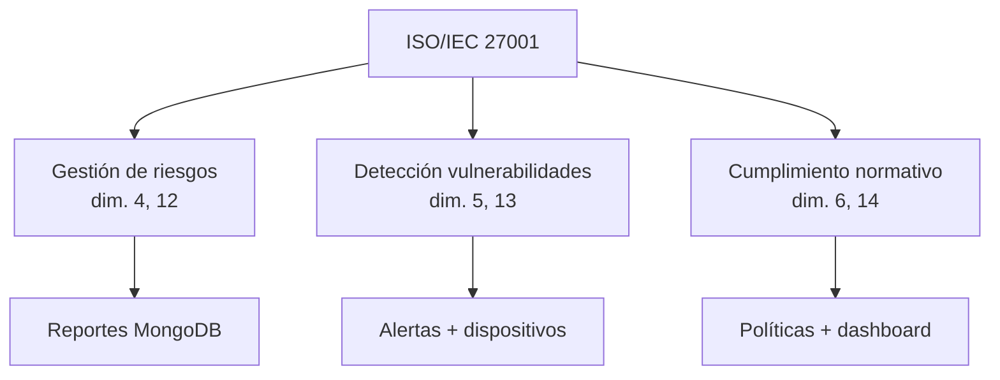

# ISO/IEC 27001 — Estado del arte aplicado

Artículos fuente: [`ISO27001 #1`](../estado_del_arte/ISO27001%20%231.md) a [`ISO27001 #5`](../estado_del_arte/ISO27001%20%235.md).

La literatura revisada trata la **implementación del SGSI (ISMS)** en instituciones públicas, PYMEs, sectores HealthTech y transporte, con énfasis en factores críticos de éxito, controles del Anexo A:2022 y análisis de riesgos.

NetGuard SOC implementa un **módulo de cumplimiento ISO integrado** en la operación SOC (no un SGSI documental completo), con checklist de controles, gestión de riesgos, reportes persistentes y exportación PDF.

---

## Resumen de adopción

| # | Artículo (abreviado) | Estado | Concepto adoptado |
|---|----------------------|--------|-------------------|
| 1 | NTP ISO 27001 instituciones públicas Perú | **Implementado** | Contexto institucional educativo; cumplimiento medible |
| 2 | ISO 27001:2022 biotech SME open-source | Parcial | Herramientas open-source (Angular, Node, MongoDB) |
| 3 | ISO 27001 PT. KAI Divre III | Parcial | Unidad de sistemas; controles operativos |
| 4 | 11 controles nuevos ISO 27001:2022 HealthTech | **Implementado** | Selección de controles Anexo A:2022 en código |
| 5 | Risk analysis framework IT consulting | **Implementado** | Matriz impacto × probabilidad, tratamientos |

---

## Cómo se implementa en el software

### 1. Checklist de controles ISO/IEC 27001:2022 (Anexo A)

**Inspiración:** #1, #4 — controles técnicos y organizacionales.

**Implementación:**

| Elemento | Ubicación |
|----------|-----------|
| Catálogo de controles | `iso.constants.ts` → `CONTROLES_ISO_27001` |
| Estado aplicado/pendiente | `IsoComplianceService.controlesIso27001` |
| Vista checklist | `politicas.component.html` |
| % cumplimiento dashboard | `vision-general.component.html` |

Controles implementados en código (selección alineada a red educativa):

| ID | Control | Dominio software |
|----|---------|------------------|
| A.5.1 | Políticas de seguridad | Módulo políticas |
| A.5.7 | Inteligencia de amenazas | Alertas + asistente SOC |
| A.5.23 | Seguridad en cloud | Documentado; despliegue Docker |
| A.8.1 | Inventario de activos | Dispositivos |
| A.8.7 | Protección contra malware | IDS + cuarentena |
| A.8.8 | Gestión de vulnerabilidades | `vulnerabilidades` computed |
| A.8.15 | Registro de eventos | Auditoría + logs SOC |
| A.8.16 | Actividades de monitoreo | Dashboard + alertas |
| A.8.20 | Seguridad de redes | VLANs + topología |
| A.8.22 | Segregación de redes | Matriz inter-VLAN |
| A.5.24 / A.5.26 | Gestión y respuesta a incidentes | Reportes + flujo IR |
| A.5.29 | Seguridad durante interrupciones | HA HSRP + métricas disponibilidad |

---

### 2. Gestión de riesgos de TI

**Inspiración:** #1, #5 — factores críticos y análisis de impacto.

**Implementación:**

| Elemento | Ubicación |
|----------|-----------|
| Modelo `RiesgoTI` | `iso.models.ts` |
| Cálculo desde alertas/vulnerabilidades | `IsoComplianceService.riesgos` |
| Matriz impacto × probabilidad | `reportes.component.html` |
| Niveles y tratamientos | `NIVELES_RIESGO`, `TRATAMIENTOS_RIESGO` en `iso.constants.ts` |

Valores: riesgo `bajo | medio | alto | critico`; tratamiento `aceptar | mitigar | transferir | evitar`.

---

### 3. Reportes de incidentes con campos ISO (persistencia real)

**Inspiración:** #3, #5 — evidencia documental del ISMS.

**Implementación:**

| Elemento | Ubicación |
|----------|-----------|
| Formulario incidente | `pages/reportes/` |
| Modelo frontend | `frontend/src/app/core/models/report.model.ts` |
| Modelo backend MongoDB | `backend/src/models/report.model.ts` |
| API REST | `backend/src/routes/report.routes.ts` |
| PDF con campos ISO | `backend/src/utils/pdf-generator.ts` |

Campos ISO en reportes:

```
isoStandard, dimension, controlIso, riesgoNivel,
impacto, probabilidad, activoAfectado, amenaza,
vulnerabilidad, tratamiento, evidenciaIso[]
```

---

### 4. Endpoints de cumplimiento (backend)

**Inspiración:** #2 — automatización con stack open-source.

| Método | Endpoint | Uso |
|--------|----------|-----|
| GET | `/api/reports/compliance-summary` | Resumen ISO 27001 + 25000 |
| GET | `/api/reports/iso27001-summary` | Detalle SGSI |
| GET | `/api/reports/iso25000-summary` | Calidad SQuaRE |
| GET | `/api/reports/:id/pdf` | Evidencia exportable |

El frontend consulta estos endpoints vía `ReportService` y `IsoComplianceService.complianceBackend`.

---

### 5. Auditoría y trazabilidad (confidencialidad — dim. 11)

**Inspiración:** #1 — factores humanos y registro de accesos.

| Elemento | Ubicación |
|----------|-----------|
| Registro de auditoría | `audit-trail.service.ts`, `audit.models.ts` |
| Vista auditoría | `pages/auditoria/` |
| RBAC | `roles.constants.ts`, guards en `app.routes.ts` |

Roles: `admin`, `operador`, `analista` con `PERMISOS_POR_ROL`.

---

### 6. Evidencias ISO vinculadas

**Inspiración:** #4 — demostración de aplicación de controles.

| Elemento | Ubicación |
|----------|-----------|
| Modelo `EvidenciaISO` | `iso.models.ts` |
| Array en reportes | `evidenciaIso[]` en incidentes |
| Correlación dimensión ↔ control | campo `dimensiones` en cada control de `CONTROLES_ISO_27001` |

---

## Variable mediadora en la tesis

La **Gestión de Seguridad basada en ISO/IEC 27001** se evidencia en dimensiones 4–6 y 12–14 de la matriz:



---

## Lo que no está implementado

| Concepto del estado del arte | Estado |
|------------------------------|--------|
| SGSI documental completo (políticas en PDF corporativas) | Fuera del alcance del software |
| Certificación ISO por organismo externo | N/A |
| Encuestas Likert de madurez organizacional | Referenciado (#1); no en la app |
| Los 93 controles del Anexo A completos | Subconjunto seleccionado (~16) |
| Statement of Applicability (SoA) formal | Futuro en entregables académicos |

---

## Cómo demostrar en la tesis

1. **Políticas** → checklist controles Anexo A con estado aplicado/pendiente.
2. **Reportes** → crear incidente con `controlIso`, riesgo y tratamiento.
3. **Exportar PDF** → evidencia con campos ISO.
4. **Dashboard** → % cumplimiento ISO 27001.
5. Citar artículo #1 (contexto institucional peruano) y #4 (controles 2022).
