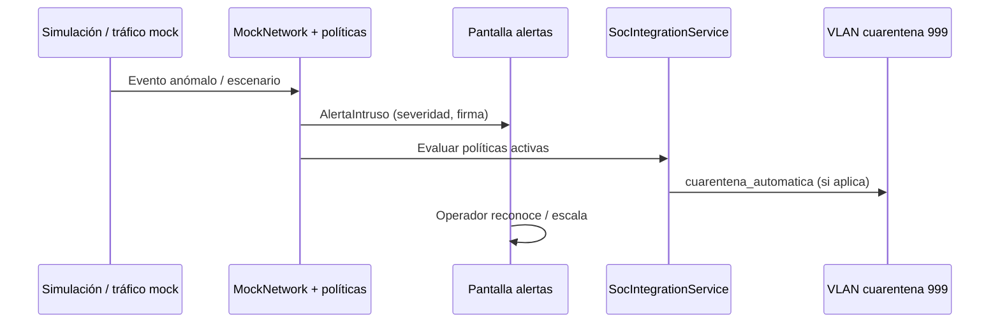

# Monitoreo e IDS — Estado del arte aplicado

Artículos fuente: [`Monitoreo #1`](../estado_del_arte/Monitoreo%20%231.md) a [`Monitoreo #9`](../estado_del_arte/Monitoreo%20%239.md).

La literatura revisada se centra en **sistemas de detección de intrusiones (NIDS/HIDS)**, machine learning, deep learning (CNN, LSTM, Transformer) y reglas Snort. El software **no implementa modelos de deep learning en producción**; en su lugar adopta un **motor IDS basado en reglas y firmas** con simulación controlada, alineado al contexto operativo SOC de una institución educativa.

---

## Resumen de adopción

| # | Artículo (abreviado) | Estado | Concepto adoptado en el software |
|---|----------------------|--------|----------------------------------|
| 1 | Transformer NIDS (cloud) | Parcial | Detección de intrusiones y clasificación por severidad; sin Transformer |
| 2 | IDS con Machine Learning (IoT) | Parcial | Arquitectura IDS híbrida (firmas + anomalías simuladas) |
| 3 | Deep learning NIDS | Parcial | Feed de alertas IDS y correlación con dispositivos |
| 4 | ML para SDN | Referenciado | Monitoreo centralizado; SDN real es futuro (GNS3) |
| 5 | IDS + Snort Community Rules | **Implementado** | Firmas de ataque, tipos DoS/DDoS/port scan, motor de reglas |
| 6 | Deep learning IDS IoT | Parcial | Inventario de dispositivos y alertas por host |
| 7 | Sequential deep learning NIDS | Referenciado | Resiliencia del IDS como métrica ISO 25000 |
| 8 | Deep learning + PSO | Referenciado | Optimización futura del motor de detección |
| 9 | CNN intrusion detection | Referenciado | Clasificación de alertas por tipo, no por CNN |

---

## Cómo se implementa en el software

### 1. Centro de alertas IDS (NIDS operativo simulado)

**Inspiración:** artículos #1–#3, #5, #6, #9 — detección de intrusiones en red, firmas y clasificación.

**Implementación:**

| Elemento | Ubicación |
|----------|-----------|
| Pantalla de alertas | `frontend/src/app/pages/alertas/` |
| Modelo `AlertaIntruso` | `frontend/src/app/core/models/network.models.ts` |
| Datos y generación mock | `frontend/src/app/core/services/mock-network.service.ts` |
| KPI «intrusos detectados» | `frontend/src/app/pages/vision-general/` |

Cada alerta incluye: IP atacante, tipo de ataque (DoS, port scan, ARP spoofing, etc.), severidad (`critico`, `alto`, `advertencia`, `info`), VLAN afectada y estado (`nueva`, `reconocida`, `cerrada`).

```typescript
// Ejemplo de campos del modelo de alerta (network.models.ts)
// ipAtacante, tipoAtaque, severidad, vlanId, firma, accionTomada
```

**Diferencia con el estado del arte:** los papers proponen modelos ML/DL entrenados con datasets (CIC-IDS, NSL-KDD). NetGuard SOC usa **reglas configurables** y datos mock para demostrar el flujo SOC sin requerir GPU ni entrenamiento.

---

### 2. Motor de reglas IDS/IPS (SecurityPolicies)

**Inspiración:** Monitoreo #5 (Snort rules), Monitoreo #4 (SDN + detección).

**Implementación:**

| Elemento | Ubicación |
|----------|-----------|
| CRUD de políticas | `frontend/src/app/pages/politicas/` |
| Servicio de políticas | `frontend/src/app/core/services/security-policy.service.ts` |
| Modelos de reglas | `frontend/src/app/core/models/policy.models.ts` |
| Sincronización con IDS | evento `Reglas sincronizadas con motor IDS/IPS` |

Las políticas definen condiciones (IP, puerto, VLAN, firma) y acciones: `notificar`, `auditar`, `cuarentena_automatica`, `limitar_trafico_inter_vlan`.

Control ISO 27001 vinculado: **A.8.16** (actividades de monitoreo) en `iso.constants.ts`.

---

### 3. Simulación controlada de ataques (laboratorio IDS)

**Inspiración:** Monitoreo #1–#3, #7 — validación experimental de NIDS.

**Implementación:**

| Elemento | Ubicación |
|----------|-----------|
| Pantalla simulación | `frontend/src/app/pages/simulacion-ataques/` |
| Servicio de escenarios | `frontend/src/app/core/services/attack-simulation.service.ts` |
| Integración SOC | `frontend/src/app/core/services/soc-integration.service.ts` |

Escenarios disponibles: DDoS, port scan, ARP spoofing, ransomware SMB, sniffing. Al ejecutar un escenario:

1. Se generan logs del motor IDS.
2. Se crean alertas con ID `IDS-SIM-XXXX`.
3. Las políticas activas pueden disparar cuarentena automática.

**Configuración:** sensibilidad IDS en `frontend/src/app/pages/configuracion/` (`SystemConfigService`).

---

### 4. Dashboard y telemetría SOC

**Inspiración:** todos los artículos — métricas de desempeño del sistema de detección.

**Implementación:**

| KPI | Pantalla / servicio |
|-----|---------------------|
| Alertas activas / críticas | `vision-general` |
| Tiempo de respuesta de alerta (&lt; 5 s) | `IsoComplianceService` → métrica ISO 25000 dim. 9 |
| Eventos procesados | `EvaluacionCalidadSoftware.eventosProcesados` |
| Funcionalidad IDS (completitud, corrección) | `METRICAS_ISO_25000` en `iso.constants.ts` |

---

### 5. Asistente IA SOC (evolución futura de NIDS inteligente)

**Inspiración:** Monitoreo #1, #8 — IA para análisis de amenazas.

**Implementación actual:** **Parcial**

| Elemento | Ubicación |
|----------|-----------|
| Componente flotante | `frontend/src/app/shared/components/soc-ai-assistant/` |
| Servicio | `frontend/src/app/core/services/soc-ai.service.ts` |

Hoy responde con plantillas y contexto mock (alertas activas, políticas violadas). **Futuro:** integrar LLM o API externa con el mismo contexto que ya expone `SocEventService`.

---

## Flujo implementado: detección → respuesta



---

## Lo que no está implementado (gap explícito)

| Concepto del estado del arte | Estado | Notas |
|------------------------------|--------|-------|
| Transformer / CNN / LSTM en producción | Futuro | Requiere backend de ML y dataset |
| Integración Snort/Suricata en vivo | Futuro | Ver `implementacion/integracion_gns3.md` |
| SNMP / NetFlow en tiempo real | Futuro | Mock actual; GNS3/VMware planificados |
| Métricas accuracy/recall/F1 de modelo ML | N/A | No aplica sin modelo entrenado |

---

## Cómo demostrar en la tesis

1. Abrir **Alertas** → mostrar feed IDS con severidades y firmas.
2. Ejecutar **Simulación de ataques** → correlacionar alertas generadas.
3. Activar política de **cuarentena automática** en **Políticas** → ver aislamiento en VLAN 999.
4. Mostrar KPI de tiempo de alerta y funcionalidad en **Visión general** (ISO 25000).
