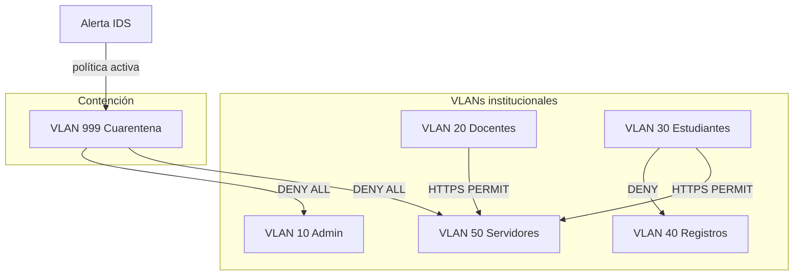

# VLAN y segmentación — Estado del arte aplicado

Artículos fuente: [`VLAN y Segmentación #1`](../estado_del_arte/VLAN%20y%20Segmentaci%C3%B3n%20%231.md) a [`VLAN y Segmentación #9`](../estado_del_arte/VLAN%20y%20Segmentaci%C3%B3n%20%239.md).

La literatura aborda VLAN 802.1Q, inter-VLAN routing, micro-segmentación, SDN/P4, modelos de seguridad por VLAN y VPN. El software implementa un **modelo de segmentación institucional educativa** con VLANs por área, matriz inter-VLAN y cuarentena lógica.

---

## Resumen de adopción

| # | Artículo (abreviado) | Estado | Concepto adoptado |
|---|----------------------|--------|-------------------|
| 1 | SDN + P4 performance | Referenciado | Programabilidad de red; SDN futuro en GNS3 |
| 2 | SDN vs Private VLAN attacks | Parcial | Segmentación para contener ataques laterales |
| 3 | VLAN enterprise security | **Implementado** | VLANs por departamento, control de broadcast |
| 4 | VLAN network model (info security) | **Implementado** | Modelo VLAN institucional documentado en código |
| 5 | Inter-VLAN routing + DHCP | **Implementado** | Routing L3 entre VLANs, gateways por segmento |
| 6 | SDN smart homes traffic class. | Referenciado | Clasificación de tráfico; no SDN en producción |
| 7 | VLAN wireless OPNET | Referenciado | Contexto académico; red cableada simulada |
| 8 | Micro-segmentation VLAN-VxLAN | Parcial | Micro-segmentación lógica sin overlay VxLAN |
| 9 | Survey VPN + VLAN | Parcial | Segmentación + aislamiento; VPN no implementada |

---

## Cómo se implementa en el software

### 1. VLANs institucionales por área académica

**Inspiración:** #3, #4, #5 — diseño de VLAN para campus/empresa.

**Implementación:**

| Elemento | Ubicación |
|----------|-----------|
| Áreas definidas | `iso.constants.ts` → `AREAS_VLAN_INSTITUCIONAL` |
| Modelo `VlanSegmento` | `frontend/src/app/core/models/network.models.ts` |
| Datos iniciales | `mock-network.service.ts` → `datosInicialesVlans()` |
| Pantalla VLANs activas | `frontend/src/app/pages/vlans/` |

VLANs modeladas:

| VLAN | Área | Propósito |
|------|------|-----------|
| 10 | Administración | Personal administrativo |
| 20 | Docentes | Planta docente |
| 30 | Estudiantes | Aulas y laboratorios |
| 40 | Registros académicos | Datos sensibles académicos |
| 50 | Servidores | Servicios centralizados |
| 999 | Cuarentena | Aislamiento de hosts comprometidos |
| — | Infraestructura | Switches y routers core |

Cada segmento expone: gateway, máscara, hosts conectados, % capacidad, tráfico 24h y bloqueos inter-VLAN.

---

### 2. Matriz de políticas inter-VLAN (micro-segmentación lógica)

**Inspiración:** #2, #4, #8 — control de tráfico entre segmentos.

**Implementación:**

| Elemento | Ubicación |
|----------|-----------|
| Matriz PERMIT/DENY | `iso.constants.ts` → `POLITICAS_TRAFICO_VLAN` |
| Tabla en UI | `vlans.component.html` |
| Políticas dinámicas | `security-policy.service.ts` → `limitar_trafico_inter_vlan` |

Ejemplos implementados:

- Estudiantes → Registros académicos: **DENY** (segregación de datos sensibles).
- Cuarentena → cualquier VLAN: **DENY ALL**.
- Docentes/Estudiantes → Servidores: **PERMIT** (HTTPS).

Control ISO 27001: **A.8.22** (segregación de redes).

---

### 3. VLAN de cuarentena (aislamiento de amenazas)

**Inspiración:** #2, #8 — contención y micro-segmentación ante compromiso.

**Implementación:**

| Elemento | Ubicación |
|----------|-----------|
| Pantalla cuarentena | `frontend/src/app/pages/vlan-cuarentena/` |
| VLAN fija 999 | `configuracion.component.html`, políticas |
| Aislamiento manual | `dispositivos` → acción «Aislar en cuarentena» |
| Aislamiento automático | `soc-integration.service.ts` → `cuarentena_automatica` |
| Computed hosts aislados | `mock-network.service.ts` → `dispositivosCuarentena` |

Al aislar un host: `seguridad: 'aislado'`, `vlan: 999`, evento de auditoría y notificación SOC.

---

### 4. Inter-VLAN routing y topología L3

**Inspiración:** #5 — router-on-a-stick / L3 switching.

**Implementación:**

| Elemento | Ubicación |
|----------|-----------|
| Mapa de topología | `frontend/src/app/pages/topologia/` |
| Nodos por segmento | `mock-network.service.ts` → `datosInicialesNodos()` |
| Gateways por VLAN | campo `gateway` en `VlanSegmento` |
| Enlaces y redundancia | `EnlaceTopologia`, switches RT-CORE |

La topología muestra capas core/distribución/acceso con color por nivel de seguridad del segmento.

---

### 5. Políticas de seguridad vinculadas a VLAN

**Inspiración:** #4, #6 — políticas de seguridad por segmento.

**Implementación:**

| Elemento | Ubicación |
|----------|-----------|
| Políticas por `vlanIds` | `policy.models.ts` → `PoliticaSeguridad` |
| UI políticas | `frontend/src/app/pages/politicas/` |

Las reglas pueden limitarse a VLANs específicas y disparar acciones de contención documentadas en [`incident_response.md`](../incident_response.md).

---

## Diagrama de segmentación en el software

---

## Lo que no está implementado

| Concepto | Estado | Referencia futura |
|--------|--------|-------------------|
| SDN / P4 / OpenFlow | Futuro | `implementacion/integracion_gns3.md` |
| VxLAN overlay | Futuro | Solo segmentación lógica VLAN |
| VPN site-to-site / WireGuard | Futuro | Artículo #9 como antecedente |
| 802.1Q tagging en hardware real | Futuro | Laboratorio GNS3 |

---

## Cómo demostrar en la tesis

1. **VLANs activas** → áreas institucionales, capacidad y bloqueos 24h.
2. **Matriz inter-VLAN** en la misma pantalla → reglas PERMIT/DENY.
3. **Cuarentena** → host aislado en VLAN 999 con ACL conceptual DENY ALL.
4. **Topología** → segmentos coloreados y gateways por VLAN.
