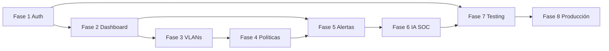

# Fases del proyecto — NetGuard SOC

Roadmap desde infraestructura base hasta producción. Cada fase tiene guía Cursor en `instrucciones/` y bitácora en `avances/`.

---

## Resumen por fase

| Fase | Nombre | Objetivo | Estado típico |
|------|--------|----------|---------------|
| 1 | Seguridad y acceso | Auth, roles, guards, interceptors | En curso / avanzado |
| 2 | Dashboard y monitoreo | KPIs, dispositivos, topología | En curso / avanzado |
| 3 | VLANs y cuarentena | Segmentación y aislamiento | En curso |
| 4 | Políticas de seguridad | Motor de reglas en UI | En curso |
| 5 | Alertas y logs | Centro de alertas, auditoría | En curso |
| 6 | Asistente IA SOC | Copiloto para analistas | Parcial (mock) |
| 7 | Testing y SonarQube | QA, cobertura, calidad estática | Configurado |
| 8 | Producción y DevOps | Docker, CI/CD, despliegue | Parcial |

---

## Fase 1 — Seguridad y acceso

**Alcance:** login, recuperación de contraseña, guards, roles, interceptor de token, rutas protegidas.

**Entregables clave:**
- `auth.service`, `auth-guard`, `role.guard`
- Constantes `ROLES`, `PERMISOS_POR_ROL`
- Páginas `login`, `recuperar-password`

**Instrucción Cursor:** [instrucciones/fase_1_seguridad_acceso_cursor.md](./instrucciones/fase_1_seguridad_acceso_cursor.md)

---

## Fase 2 — Dashboard y monitoreo

**Alcance:** visión general SOC, dispositivos conectados, mapa de topología, KPIs.

**Entregables clave:**
- `vision-general`, `dispositivos`, `topologia`
- `mock-network.service`, `dashboard-layout.service`
- Componentes `kpi-card`, gráficos Chart.js

**Instrucción Cursor:** [instrucciones/fase_2_dashboard_monitoreo_cursor.md](./instrucciones/fase_2_dashboard_monitoreo_cursor.md)

---

## Fase 3 — VLANs y cuarentena

**Alcance:** gestión de VLANs activas, VLAN de cuarentena, flujo de aislamiento.

**Entregables clave:**
- `vlans`, `vlan-cuarentena`
- Dominios `VLANManagement`, `Quarantine`

**Instrucción Cursor:** [instrucciones/fase_3_vlans_cuarentena_cursor.md](./instrucciones/fase_3_vlans_cuarentena_cursor.md)

---

## Fase 4 — Políticas de seguridad

**Alcance:** CRUD de políticas, reglas, severidad, acciones automáticas (UI).

**Entregables clave:**
- `politicas`, `security-policy.service`
- Modelos `policy.models`

**Instrucción Cursor:** [instrucciones/fase_4_politicas_seguridad_cursor.md](./instrucciones/fase_4_politicas_seguridad_cursor.md)

---

## Fase 5 — Alertas y logs

**Alcance:** centro de alertas, notificaciones, auditoría, exportación.

**Entregables clave:**
- `alertas`, `auditoria`, `reportes`
- `audit-trail.service`, `notification-center.service`

**Instrucción Cursor:** [instrucciones/fase_5_alertas_logs_cursor.md](./instrucciones/fase_5_alertas_logs_cursor.md)

---

## Fase 6 — Asistente IA SOC

**Alcance:** panel de asistente, contexto de alertas, recomendaciones de respuesta.

**Entregables clave:**
- `soc-ai-assistant`, `soc-ai.service`

**Instrucción Cursor:** [instrucciones/fase_6_asistente_ia_soc_cursor.md](./instrucciones/fase_6_asistente_ia_soc_cursor.md)

---

## Fase 7 — Testing, QA y SonarQube

**Alcance:** pruebas unitarias Vitest, CI, cobertura, análisis SonarQube.

**Entregables clave:**
- `*.spec.ts`, `.github/workflows/ci.yml`
- `sonar-project.properties`

**Instrucción Cursor:** [instrucciones/fase_7_testing_qa_sonarqube_cursor.md](./instrucciones/fase_7_testing_qa_sonarqube_cursor.md)

---

## Fase 8 — Producción y DevOps

**Alcance:** Docker, nginx, variables de entorno, pipeline de release.

**Entregables clave:**
- `Dockerfile`, `deployment.md`, release plan v1.0.0

**Instrucción Cursor:** [instrucciones/fase_8_produccion_devops_cursor.md](./instrucciones/fase_8_produccion_devops_cursor.md)

---

## Dependencias entre fases

---

## Criterio de cierre del proyecto (v1.0.0)

- Frontend estable desplegable en Docker
- Contrato OpenAPI publicado (backend implementado o documentado)
- Flujo completo: alerta → clasificación → cuarentena → auditoría
- Documentación y entregables académicos completos en `entregables/`

Ver: [implementacion/release-plan-v1.0.0.md](./implementacion/release-plan-v1.0.0.md)
