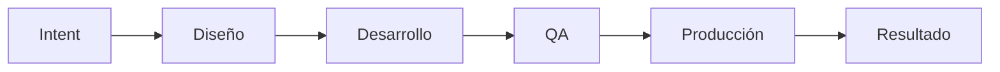

# Gobierno de IA — NetGuard SOC / MyMonitoreo

Plantilla de **trazabilidad y gobernanza del desarrollo asistido por IA** (Cursor Agent, copiloto SOC y contribuciones humanas) para el proyecto **NetGuard SOC** (*MyMonitoreo*): sistema de monitoreo de red, segmentación VLAN, detección de intrusos y operaciones SOC/NOC bajo ISO/IEC 27001.

Esta carpeta replica en Markdown las 12 hojas de la plantilla de Gobierno IA. Cada archivo es una hoja editable; los identificadores `ID_BOLT` y `ID_PROCESO` enlazan registros entre hojas de forma análoga a un libro Excel de gobierno.

---

## Propósito

| Objetivo | Descripción |
|----------|-------------|
| **Trazabilidad** | Registrar qué cambio de código, documentación o configuración proviene de qué intención, requerimiento o actividad BPMN. |
| **Control humano** | Marcar cuándo un Bolt generado o modificado por agente IA requiere revisión humana antes de integrarse (`REQUIERE_REVISION_HUMANA`). |
| **Ciclo AI-DLC** | Seguir el avance de cada Bolt por las etapas Intent → Diseño → Desarrollo → QA → Producción. |
| **Alineación académica** | Vincular entregables de tesis (matriz de operacionalización, fases 1–8, dominios DDD) con el trabajo real en `frontend/`, `backend/` y `documentacion/`. |
| **Indicadores** | Consolidar en `DASHBOARD.md` métricas calculadas desde las demás hojas (bolts, procesos por tipo). |

**Contexto del repositorio:**

- **Frontend:** Angular 21 — `frontend/src/app/` (páginas en `pages/`, servicios en `core/services/`, modelos en `core/models/`)
- **Backend:** Node.js + Express — `backend/src/` (API de reportes, PDF, MongoDB)
- **Documentación:** `documentacion/` (fases, reglas, procesos, matriz-operacionalizacion)
- **Dominios DDD:** Auth, Users, NetworkMonitoring, VLANManagement, SecurityPolicies, ThreatDetection, IncidentResponse, Quarantine, AuditLogs, SOC_AI_Assistant

---

## Hojas de la plantilla

| Archivo | Descripción en una línea |
|---------|--------------------------|
| [PROCESOS.md](./PROCESOS.md) | Catálogo de procesos del sistema (estratégicos, misionales, apoyo) con rama Git y responsable. |
| [ACTIVIDADES_BPMN.md](./ACTIVIDADES_BPMN.md) | Actividades BPMN por proceso: rol, tipo, descripción y módulo Angular/backend afectado. |
| [FLUJO_BPMN.md](./FLUJO_BPMN.md) | Nodos y transiciones del flujo BPMN (eventos, gateways, actividades). |
| [REQUERIMIENTOS.md](./REQUERIMIENTOS.md) | Requerimientos funcionales (RF) y no funcionales (RNF) vinculados a PMV y Bolts. |
| [CONTROL_VERSIONES.md](./CONTROL_VERSIONES.md) | Registro versionado de cada Bolt: commit, PR, agente, confianza y revisión humana. |
| [AI_DLC.md](./AI_DLC.md) | Estado del ciclo de vida AI-DLC por Bolt (Intent → Producción). |
| [DEPENDENCIAS.md](./DEPENDENCIAS.md) | Dependencias entre Bolts y tipo de impacto (bloqueante, opcional, etc.). |
| [MERGES.md](./MERGES.md) | Historial de merges entre ramas Git del proyecto. |
| [HISTORIAL.md](./HISTORIAL.md) | Línea de tiempo de eventos por Bolt (creación, revisión, despliegue). |
| [ARTEFACTOS.md](./ARTEFACTOS.md) | Archivos y rutas del repositorio asociados a cada Bolt. |
| [PMV.md](./PMV.md) | Productos Mínimos Viables por fase del roadmap (fases 1–8). |
| [DASHBOARD.md](./DASHBOARD.md) | Indicadores agregados del proyecto (cálculo automático desde las demás hojas). |

---

## Cómo llenar los campos

### Identificador trazable: `ID_BOLT`

Formato recomendado:

```
BOLT-{DOMINIO}-{SECUENCIA}
```

| Segmento | Valores del proyecto |
|----------|----------------------|
| `DOMINIO` | Código del dominio o módulo: `AUTH`, `NET`, `VLAN`, `POL`, `ALT`, `AUD`, `REP`, `CFG`, `IA`, `SIM`, `ISO`, `BE` (backend), `DOC` (documentación), `DEV` (DevOps/CI) |
| `SECUENCIA` | Tres dígitos: `001`, `002`, … |

**Ejemplos reales del catálogo inicial:**

| ID_BOLT | Módulo / ruta |
|---------|----------------|
| `BOLT-AUTH-001` | Login, guards — `frontend/src/app/pages/login/`, `core/guards/` |
| `BOLT-NET-001` | Dashboard SOC — `pages/vision-general/` |
| `BOLT-VLAN-001` | VLANs activas — `pages/vlans/` |
| `BOLT-IA-001` | Asistente SOC — `soc-ai.service.ts`, componente flotante |
| `BOLT-ISO-001` | Cumplimiento ISO — `iso-compliance.service.ts`, `iso.constants.ts` |
| `BOLT-BE-001` | API reportes — `backend/src/routes/report.routes.ts` |

**Reglas de trazabilidad:**

1. Un Bolt = una unidad de cambio coherente (feature, fix documentado, refactor acotado).
2. El mismo `ID_BOLT` debe aparecer en `ACTIVIDADES_BPMN`, `REQUERIMIENTOS`, `AI_DLC`, `ARTEFACTOS` y, si aplica, `CONTROL_VERSIONES` e `HISTORIAL`.
3. `ID_PROCESO` enlaza con `documentacion/procesos/clasificacion_procesos.md` (procesos 1–32).
4. `ID_REQUERIMIENTO` usa prefijo `RF-` o `RNF-` + dominio + secuencia (`RF-NET-002`).
5. `ID_PMV` corresponde a las fases en `documentacion/fases.md` (`PMV-F01` … `PMV-F08`).
6. Al cerrar un cambio en Git, registrar `COMMIT` y `PULL_REQUEST` en `CONTROL_VERSIONES.md`.

### Otros identificadores

| Campo | Convención |
|-------|------------|
| `ID_PROCESO` | `PROC-{TIPO}-{NN}` — `EST` (estratégico), `MIS` (misional), `APO` (apoyo) + número alineado al proceso 1–32 |
| `ID_NODO` | `N-{ID_PROCESO}-{NN}` en flujos BPMN |
| `ID_ARTEFACTO` | `ART-{TIPO}-{NN}` — tipos: `SRC`, `DOC`, `CFG`, `TEST` |
| `MERGE_ID` | `MR-{AAAA}-{NNN}` |
| `ID_REGISTRO` | `CV-{ID_BOLT}-v{VERSION}` |

### Campos de estado

| Campo | Valores permitidos | Uso |
|-------|-------------------|-----|
| `ESTADO` (proceso) | `activo`, `inactivo`, `deprecado` | Si el proceso sigue vigente en el producto |
| `ESTADO` (requerimiento) | `pendiente`, `en_progreso`, `completado`, `cancelado` | Avance del RF/RNF |
| `ESTADO_BOLT` | `activo`, `inactivo`, `producción` | Ver convenciones abajo |
| `ESTADO_INTEGRACION` | `local`, `rama_feature`, `develop`, `main`, `producción` | Dónde está integrado el Bolt |
| Etapas AI-DLC | `pendiente`, `en_curso`, `completado`, `no_aplica` | Por columna Intent … Producción |

### Campos de agente IA

| Campo | Descripción |
|-------|-------------|
| `AGENTE_RESPONSABLE` | Identificador del agente Cursor o herramienta (`cursor-agent`, `soc-ai-mock`, `humano`) |
| `FUENTE` | Origen del cambio: `cursor`, `manual`, `ci`, `import` |
| `CONFIANZA` | `alta`, `media`, `baja` — evaluación post-revisión |
| `REQUIERE_REVISION_HUMANA` | `si` / `no` — obligatorio `si` en cambios de seguridad, cuarentena, políticas y auth |

---

## Convenciones del proyecto

### ¿Qué es un Bolt?

Un **Bolt** (*building block of traceable logic*) es la **unidad mínima de trabajo trazable** en esta plantilla: agrupa intención, requerimiento, actividades BPMN, artefactos de código y versiones. No coincide necesariamente con un commit único; puede abarcar varios archivos bajo un mismo `ID_BOLT` (p. ej. `BOLT-VLAN-002` = VLAN cuarentena + modelo + servicio mock).

En NetGuard SOC, un Bolt típico mapea a:

- Una pantalla en `frontend/src/app/pages/{modulo}/`
- Un dominio DDD y su servicio en `core/services/`
- Un endpoint o módulo en `backend/src/`
- Un documento en `documentacion/avances/` o `documentacion/instrucciones/`

### ¿Qué es el AI-DLC?

**AI-DLC** (*AI Development Life Cycle*) es el ciclo de madurez de un Bolt cuando el desarrollo está **asistido por IA**:



| Etapa | En este proyecto |
|-------|------------------|
| **Intent** | Prompt Cursor, instrucción en `documentacion/instrucciones/fase_N_*.md` o issue académico |
| **Diseño** | Alineación con `arquitectura.md`, `reglas/ddd.md`, modelos en `core/models/` |
| **Desarrollo** | Código en `frontend/` o `backend/`, datos mock o API |
| **QA** | `*.spec.ts`, Vitest, SonarQube (`sonar-project.properties`), CI en `.github/workflows/ci.yml` |
| **Producción** | Merge a `main`, Docker/nginx, despliegue según `deployment.md` |
| **Resultado** | `completado`, `parcial`, `rechazado`, `pendiente_revision` |

El dominio **SOC_AI_Assistant** (`reglas/ia.md`) es apoyo al operador; su Bolt `BOLT-IA-001` no sustituye la decisión humana en cuarentena ni cambios de política.

### ¿Qué significa ESTADO (activo / inactivo / producción)?

Aplica principalmente a **Bolts** y procesos:

| Valor | Significado en NetGuard SOC |
|-------|----------------------------|
| **activo** | Bolt en uso en la rama de trabajo actual; código presente y funcional (p. ej. mock en frontend). |
| **inactivo** | Bolt suspendido, reemplazado o fuera del alcance actual; no eliminar historial. |
| **producción** | Bolt integrado en versión desplegable o estable (`main` / release); listo para operación SOC según `manualdeusuario.md`. |

*Nota:* Muchos módulos del frontend están en estado **activo** (mock) pero aún no en **producción** hasta completar backend, persistencia y Fase 8 DevOps.

### ¿Qué es PMV en el contexto del proyecto?

**PMV** = **Producto Mínimo Viable** por **fase del roadmap** (`documentacion/fases.md`). Cada `ID_PMV` agrupa Bolts y requerimientos necesarios para cerrar una fase con criterio de aceptación documentado en `documentacion/avances/`.

| ID_PMV | Fase | Entregable representativo |
|--------|------|---------------------------|
| PMV-F01 | Seguridad y acceso | Auth, guards, login |
| PMV-F02 | Dashboard y monitoreo | vision-general, dispositivos, topología |
| PMV-F03 | VLANs y cuarentena | vlans, vlan-cuarentena |
| PMV-F04 | Políticas de seguridad | politicas, security-policy.service |
| PMV-F05 | Alertas y logs | alertas, auditoria, reportes |
| PMV-F06 | Asistente IA SOC | soc-ai-assistant (mock) |
| PMV-F07 | Testing y SonarQube | specs, CI |
| PMV-F08 | Producción y DevOps | Docker, despliegue |

Un requerimiento puede marcarse `PMV = PMV-F03` si solo es necesario para cerrar la fase 3.

---

## Relación con otra documentación

| Documento | Relación |
|-----------|----------|
| [../procesos/clasificacion_procesos.md](../procesos/clasificacion_procesos.md) | Origen de `ID_PROCESO` y tipos estratégico/misional/apoyo |
| [../procesos/macroprocesos.md](../procesos/macroprocesos.md) | Macroprocesos MP1–MP12 y flujo operativo SOC |
| [../fases.md](../fases.md) | Definición de PMV-F01 … PMV-F08 |
| [../reglas/ia.md](../reglas/ia.md) | Reglas del dominio SOC_AI_Assistant |
| [../matriz-operacionalizacion/](../matriz-operacionalizacion/) | Variables de tesis y dimensiones 1–15 |
| [../README.md](../README.md) | Índice general de documentación |

---

## Mantenimiento

1. Al iniciar trabajo con Cursor sobre un módulo: crear o actualizar fila en `AI_DLC.md` y `REQUERIMIENTOS.md`.
2. Al terminar implementación: completar `CONTROL_VERSIONES.md`, `ARTEFACTOS.md` e `HISTORIAL.md`.
3. Tras merge a rama principal: actualizar `MERGES.md` y etapa Producción en `AI_DLC.md`.
4. Recalcular indicadores en `DASHBOARD.md` (ver fórmulas en ese archivo).

*Última actualización de plantilla: junio 2026 — alineada a Angular 21 + backend parcial de reportes.*

## Relación con control de versiones

La evaluación cualitativa (checklist AI-DLC por Bolt) vive en [../control_versiones/](../control_versiones/). Usar el mismo `ID_BOLT` en ambas carpetas.
