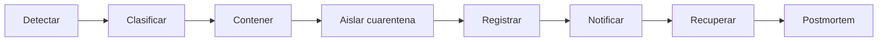

# Respuesta a incidentes (Incident Response)

Procedimiento operativo para manejar intrusos y amenazas detectadas en NetGuard SOC.

---

## Alcance

Aplica a eventos generados por:

- Motor de reglas / políticas de seguridad
- Simulación de ataques (laboratorio)
- Integraciones futuras (sensores, GNS3, IDS)

---

## Fases del ciclo

---

## 1. Detectar

| Fuente | Acción |
|--------|--------|
| Dashboard KPI | Pico de alertas o dispositivos offline |
| Centro de alertas | Nueva alerta con severidad ≥ media |
| Auditoría | Patrón repetido de violaciones |
| Asistente IA SOC | Sugerencia de correlación (futuro) |

**Responsable:** Operador o analista en turno.

---

## 2. Clasificar severidad

| Nivel | Criterio ejemplo | SLA orientativo |
|-------|------------------|-----------------|
| Crítica | Compromiso confirmado, movimiento lateral | < 15 min respuesta |
| Alta | Explotación probable, datos sensibles | < 1 h |
| Media | Política violada, sin impacto confirmado | < 4 h |
| Baja | Anomalía menor, escaneo no agresivo | < 24 h |

Registrar clasificación en el detalle del incidente (futuro ticket en backend).

---

## 3. Contener

Acciones inmediatas sin necesariamente aislar aún:

- Bloquear regla temporal en firewall (futuro)
- Deshabilitar cuenta comprometida (Users/Auth)
- Aumentar logging en segmento afectado
- Notificar al responsable de red

---

## 4. Aislar en VLAN de cuarentena

**Dominio:** Quarantine

1. Ir a **VLAN de cuarentena** o desde detalle de dispositivo/alerta
2. Confirmar host (IP/MAC) a aislar
3. Ejecutar **Aislar en cuarentena**
4. Verificar aparición en lista de cuarentena
5. Validar que el tráfico productivo no cruza con segmentos críticos

> En estado actual la operación es simulada en frontend; con backend, la API ejecutará cambio en switch virtual GNS3 o política VMware.

---

## 5. Registrar incidente

**Dominio:** AuditLogs + IncidentResponse

Campos mínimos del registro:

| Campo | Obligatorio |
|-------|-------------|
| ID incidente | Sí |
| Timestamp inicio | Sí |
| Severidad | Sí |
| Hosts afectados | Sí |
| Política / firma | Si aplica |
| Acciones tomadas | Sí |
| Operador | Sí |

La UI de **Auditoría** refleja eventos automáticos al confirmar acciones.

---

## 6. Notificar

| Audiencia | Canal |
|-----------|-------|
| Equipo SOC | Centro de notificaciones, dashboard |
| Admin red | Email / webhook (futuro) |
| Dirección | Solo críticos — reporte PDF |

---

## 7. Recuperar

1. Erradicar causa (parche, regla, credencial rotada)
2. **Liberar** host de cuarentena tras validación
3. Restaurar VLAN de producción
4. Monitoreo reforzado 24–72 h

---

## 8. Postmortem

Documentar en `entregables/` o wiki interna:

- Línea de tiempo
- Root cause
- Qué funcionó / qué falló
- Acciones preventivas (nueva política, segmentación)

Plantilla sugerida en [entregables/informe_final.md](./entregables/informe_final.md).

---

## Matriz de roles

| Acción | Admin | Operador | Analista |
|--------|-------|----------|----------|
| Ver alertas | ✓ | ✓ | ✓ |
| Aislar cuarentena | ✓ | ✓ | — |
| Editar políticas | ✓ | ✓ | — |
| Configuración | ✓ | — | — |
| Simulación ataques | ✓ | ✓ | ✓ |
| Postmortem | ✓ | ✓ | ✓ |

---

## Referencias

- [manualdeusuario.md](./manualdeusuario.md) — VLAN cuarentena
- [arquitectura.md](./arquitectura.md) — flujo detección
- [backup_restore.md](./backup_restore.md) — restauración post-incidente
