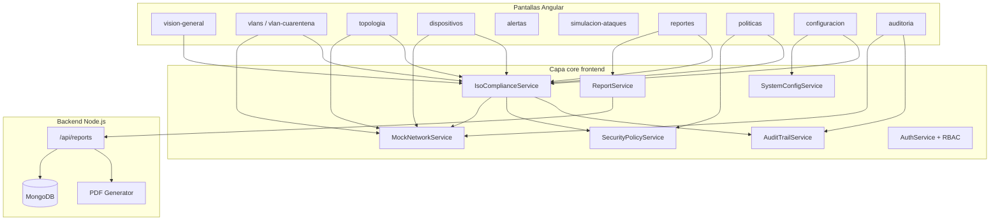

# Mapeo de implementación — Variables y dimensiones en NetWatch Pro

Este documento describe **cómo funciona la aplicación** desde la perspectiva de la matriz de operacionalización de la tesis. Indica en qué pantallas, modelos, servicios y endpoints del backend se evidencia cada variable y cada una de las 15 dimensiones.

**Producto:** NetWatch Pro (interfaz SOC **NetGuard SOC**)  
**Stack:** Angular 21 (frontend) · Express + MongoDB (reportes) · datos de red en simulación mock

---

## 1. Variables de la tesis

| Variable | Tipo en la matriz | Implementación en el software |
|----------|-------------------|------------------------------|
| **Arquitectura de Red Ciberresiliente** | Independiente | Dimensiones 1, 2 y 3 — VLANs, alta disponibilidad (HSRP), resiliencia de infraestructura |
| **Gestión de Seguridad de la Información basada en ISO/IEC 27001** | Mediadora | Dimensiones 4, 5 y 6 — riesgos, vulnerabilidades, checklist de controles Anexo A |
| **Calidad del Software de Monitoreo basada en ISO/IEC 25000 SQuaRE** | Mediadora | Dimensiones 7, 8, 9 y 10 — métricas funcionales, fiabilidad, eficiencia, mantenibilidad |
| **Postura de Ciberseguridad Institucional** | Dependiente | Dimensiones 11 a 15 — confidencialidad, riesgos, vulnerabilidades, cumplimiento y confianza |

**Fuente en código:** `frontend/src/app/core/constants/iso.constants.ts` → constante `VARIABLES_TESIS` y arreglo `DIMENSIONES_MATRIZ`.

---

## 2. Arquitectura funcional resumida



### Fuentes de datos

| Capa | Qué persiste | Uso en la matriz |
|------|--------------|------------------|
| **Mock en memoria** | Dispositivos, VLANs, alertas, topología, métricas | Dimensiones 1–3, 5, 7, 9 (simulación SOC) |
| **localStorage** | Políticas, configuración, audit trail de usuarios | Dimensiones 6, 10, 11 |
| **MongoDB (backend)** | Reportes de incidentes con campos ISO | Dimensiones 4, 6, 12, 14 |
| **Cálculo derivado** | `IsoComplianceService` | KPIs agregados, riesgos, cumplimiento, confianza |

---

## 3. Navegación de la aplicación

| Ruta | Pantalla | Rol en la matriz |
|------|----------|------------------|
| `/vision-general` | Dashboard SOC | KPIs transversales (todas las variables) |
| `/dispositivos` | Inventario de hosts | Dim. 3, 5, 7, 13 |
| `/alertas` | Centro de alertas IDS | Dim. 4, 5, 7, 13 |
| `/vlans` | VLANs activas | Dim. 1 |
| `/vlan-cuarentena` | Cuarentena VLAN 999 | Dim. 1, 14 |
| `/topologia` | Mapa de red L3 | Dim. 1, 2, 3 |
| `/simulacion-ataques` | Laboratorio IDS | Dim. 5, 7, 13 |
| `/auditoria` | Logs y auditoría de usuarios | Dim. 6, 8, 10, 11 |
| `/reportes` | Incidentes y cumplimiento ISO | Dim. 4, 6, 12, 14, 15 |
| `/politicas` | Políticas + controles ISO 27001 | Dim. 1, 6, 14 |
| `/configuracion` | Parámetros + calidad ISO 25000 | Dim. 8, 10, 14 |
| `/perfil` | Perfil y actividad personal | Dim. 11 (complementario) |

Definición de rutas: `frontend/src/app/app.routes.ts`  
Títulos y constantes: `frontend/src/app/core/constants/routes.constants.ts`  
Menú lateral: `frontend/src/app/layouts/main-layout/main-layout.component.ts`

---

## 4. Mapeo por dimensión (1–15)

### Dimensión 1 — Segmentación de red mediante VLAN

**Variable:** Arquitectura de Red Ciberresiliente

| Evidencia | Ubicación |
|-----------|-----------|
| Áreas institucionales por VLAN | `VlanSegmento.areaInstitucional` en `network.models.ts` |
| VLANs: Administración, Docentes, Estudiantes, Registros académicos, Servidores, Cuarentena | `mock-network.service.ts` → `datosInicialesVlans()` |
| Etiquetas de área | `iso.constants.ts` → `AREAS_VLAN_INSTITUCIONAL`, `AREA_VLAN_LABELS` |
| Vista de segmentos con gateway, tráfico, bloqueos 24h | `pages/vlans/` |
| Matriz de políticas inter-VLAN (PERMIT/DENY) | `iso.constants.ts` → `POLITICAS_TRAFICO_VLAN`; tabla en `vlans.component.html` |
| VLAN de cuarentena (999) y ACL DENY ALL | `pages/vlan-cuarentena/` |
| Separación lógica en topología | `pages/topologia/` (nodos por segmento, color por seguridad) |
| Políticas por `vlanIds` | `pages/politicas/`, `policy.models.ts`, `security-policy.service.ts` |

**Indicadores visibles:** hosts por VLAN, % capacidad, bloqueos inter-VLAN, enlace a cuarentena.

---

### Dimensión 2 — Alta disponibilidad de red

**Variable:** Arquitectura de Red Ciberresiliente

| Evidencia | Ubicación |
|-----------|-----------|
| Gateways HSRP activo/respaldo (RT-CORE-01 / RT-CORE-02) | `iso-compliance.service.ts` → `gateways` |
| KPI gateway activo y respaldo | `MetricasDashboard` en `network.models.ts`; dashboard `vision-general` |
| Tiempo de recuperación (RTO) | `kpiDisponibilidadRed`, `eventosDisponibilidad` en `iso-compliance.service.ts` |
| Barra HA en topología | `topologia.component.html` |
| Eventos de failover / degradación | `iso.models.ts` → `EventoDisponibilidad`; logs mock con módulo `HSRP` |
| % disponibilidad de red | KPI en dashboard y `kpiDisponibilidadRed.porcentaje` |

**Indicadores visibles:** gateway activo, gateway respaldo, RTO promedio (seg), disponibilidad %.

---

### Dimensión 3 — Resiliencia de infraestructura TI

**Variable:** Arquitectura de Red Ciberresiliente

| Evidencia | Ubicación |
|-----------|-----------|
| Índice de resiliencia, equipos redundantes | `iso-compliance.service.ts` → `resiliencia` |
| Puntos únicos de fallo (SPOF) | `iso.models.ts` → `PuntoUnicoFallo`; panel dashboard y `dispositivos` |
| Redundancia RT-CORE, SW-DIST | `mock-network.service.ts` (dispositivos 01/02) |
| Balanceo de carga (indicador) | `ResilienciaInfraestructura.balanceoCargaActivo` |
| Estabilidad de servicios (uptime por host) | `pages/dispositivos/`, `pages/topologia/` |
| Campos opcionales en dispositivo | `redundante`, `puntoUnicoFallo` en `DispositivoRed` |

**Indicadores visibles:** índice resiliencia %, SPOF detectados, equipos redundantes/total.

---

### Dimensión 4 — Gestión de riesgos en la protección de TI

**Variable:** Gestión de Seguridad ISO/IEC 27001 (mediadora)

| Evidencia | Ubicación |
|-----------|-----------|
| Modelo de riesgo | `iso.models.ts` → `RiesgoTI` |
| Cálculo desde vulnerabilidades | `iso-compliance.service.ts` → `riesgos` |
| Matriz impacto × probabilidad | `reportes.component.html` (tabla con semáforo) |
| Campos en reportes MongoDB | `impacto`, `probabilidad`, `riesgoNivel`, `tratamiento`, `activoAfectado`, `amenaza`, `controlIso` |
| Formulario de incidente | `reportes.component.ts` / `.html` (fieldset ISO) |
| Severidad de alertas (entrada al riesgo) | `pages/alertas/`, `alerta.model.ts` / `network.models.ts` |

**Valores de riesgo:** `bajo` · `medio` · `alto` · `critico`  
**Tratamientos:** `aceptar` · `mitigar` · `transferir` · `evitar`

---

### Dimensión 5 — Detección sistemática de vulnerabilidades

**Variable:** Gestión de Seguridad ISO/IEC 27001 (mediadora)

| Evidencia | Ubicación |
|-----------|-----------|
| Modelo de vulnerabilidad | `iso.models.ts` → `VulnerabilidadTI` |
| Tipos: SNMP perdido, puerto sospechoso, tráfico anómalo, dispositivo comprometido | `iso.constants.ts` → `TIPOS_VULNERABILIDAD` |
| Estados: detectada, en_analisis, mitigada, cerrada | `ESTADOS_VULNERABILIDAD` |
| Detección derivada de alertas/dispositivos | `iso-compliance.service.ts` → `vulnerabilidades` |
| Columna vulnerabilidades por dispositivo | `dispositivos.component.html` |
| Alertas IDS (firmas, puertos, VLAN) | `pages/alertas/`, `mock-network.service.ts` |
| Simulación de ataques | `pages/simulacion-ataques/` |
| Campo `vulnerabilidad` en reportes | `report.model.ts` (frontend y backend) |

---

### Dimensión 6 — Cumplimiento normativo y estándares internacionales

**Variable:** Gestión de Seguridad ISO/IEC 27001 (mediadora)

| Evidencia | Ubicación |
|-----------|-----------|
| Checklist controles Anexo A | `iso.constants.ts` → `CONTROLES_ISO_27001` |
| Evaluación de controles aplicados/pendientes | `iso-compliance.service.ts` → `controlesIso27001`, `cumplimientoIso27001` |
| Vista checklist en políticas | `politicas.component.html` |
| Panel cumplimiento en reportes | `reportes.component.html` |
| Evidencias vinculadas | `iso.models.ts` → `EvidenciaISO`; campos `evidenciaIso[]` en reportes |
| % cumplimiento ISO 27001 en dashboard | `vision-general.component.html` |
| Endpoints de resumen | `GET /api/reports/compliance-summary`, `/iso27001-summary` |

**Controles documentados (ej.):** A.5.1, A.8.7, A.8.8, A.8.15, A.8.16, A.8.20, A.8.22, A.5.26, A.5.29

---

### Dimensión 7 — Funcionalidad y adecuación funcional

**Variable:** Calidad del Software ISO/IEC 25000 (mediadora)

| Evidencia | Ubicación |
|-----------|-----------|
| Métricas: completitud, corrección, pertinencia funcional | `iso.constants.ts` → `METRICAS_ISO_25000` |
| Detección de intrusión (IDS) | `pages/alertas/`, `pages/vision-general/` |
| IP atacante, tipo de ataque, acción tomada | `AlertaIntruso`, reportes `attackerIp`, `actionTaken` |
| Simulación controlada de ataques | `pages/simulacion-ataques/` |
| Comparación con logs/evidencia | reportes `logs[]`, `evidence[]`; auditoría |
| KPI funcionalidad en evaluación software | `iso-compliance.service.ts` → `metricasIso25000` |

---

### Dimensión 8 — Fiabilidad y disponibilidad del software

**Variable:** Calidad del Software ISO/IEC 25000 (mediadora)

| Evidencia | Ubicación |
|-----------|-----------|
| Uptime y disponibilidad del software (48h) | `iso.models.ts` → `EvaluacionCalidadSoftware` |
| Estado backend / base de datos | `backendEstado`, `baseDatosEstado` en evaluación |
| KPI en dashboard | `uptimeSoftwarePct`, panel matriz en `vision-general` |
| Health check backend | `GET /health` en `backend/src/app.ts` |
| Eventos de caída/recuperación (red) | `eventosDisponibilidad` (referencia cruzada operativa) |
| Pérdida SNMP (vulnerabilidad) | tipo `snmp_perdido` en vulnerabilidades |

---

### Dimensión 9 — Eficiencia en el desempeño

**Variable:** Calidad del Software ISO/IEC 25000 (mediadora)

| Evidencia | Ubicación |
|-----------|-----------|
| Tiempo de respuesta de alerta (&lt; 5 s) | `EvaluacionCalidadSoftware.tiempoRespuestaAlertaMs`; métrica `tiempo_respuesta_alerta` |
| CPU y memoria del software | `cpuUso`, `memoriaUso` en evaluación |
| Eventos procesados | `eventosProcesados` |
| Telemetría sin pérdida | `telemetriaSinPerdida` |
| Refresco configurable del dashboard | `config.models.ts` → `refrescoDashboardSeg` |
| Indicador en dashboard | panel matriz — alerta en segundos, CPU % |

---

### Dimensión 10 — Mantenibilidad y portabilidad

**Variable:** Calidad del Software ISO/IEC 25000 (mediadora)

| Evidencia | Ubicación |
|-----------|-----------|
| Sección «Calidad técnica ISO 25000» | `configuracion` → pestaña `calidad-iso` |
| Módulos del sistema documentados | `iso.constants.ts` → `MODULOS_SISTEMA` |
| Checklist instalación (Node, MongoDB, Angular, SNMP, Cisco/MikroTik) | `configuracion.component.html` |
| Métricas modularidad, SNMP, documentación | `METRICAS_ISO_25000` |
| Dependencias críticas listadas | sección calidad-iso en configuración |
| Documentación técnica del repo | carpeta `documentacion/` (este documento) |

---

### Dimensión 11 — Confidencialidad de la información

**Variable:** Postura de Ciberseguridad Institucional (dependiente)

| Evidencia | Ubicación |
|-----------|-----------|
| Roles RBAC | `roles.constants.ts` → `admin`, `operador`, `analista` |
| Permisos por módulo | `PERMISOS_POR_ROL`, guards en `app.routes.ts` |
| Registro de accesos y acciones | `audit-trail.service.ts`, `audit.models.ts` |
| Vista auditoría de usuarios | `auditoria.component.html` → pestaña «Auditoría usuarios» |
| Actividad en perfil | `pages/perfil/` |
| Configuración solo admin | ruta `/configuracion` con `roleGuard` |
| Protección datos en cuarentena | `vlan-cuarentena` — aislamiento VLAN 999 |

---

### Dimensión 12 — Gestión de riesgos en seguridad TI

**Variable:** Postura de Ciberseguridad Institucional (dependiente)

| Evidencia | Ubicación |
|-----------|-----------|
| Misma matriz de riesgo que dim. 4 | `reportes` — tabla `iso.riesgos()` |
| Campos en incidentes persistentes | backend `report.model.ts` |
| Relación con control ISO | campo `controlIso` en reportes |
| PDF con riesgo y tratamiento | `backend/src/utils/pdf-generator.ts` |

*Nota académica:* la dimensión 12 se evidencia como **resultado** de la gestión de riesgos registrada en incidentes y reportes exportables.

---

### Dimensión 13 — Detección sistemática de vulnerabilidades (dependiente)

**Variable:** Postura de Ciberseguridad Institucional (dependiente)

| Evidencia | Ubicación |
|-----------|-----------|
| Listado consolidado de vulnerabilidades | `iso-compliance.service.ts` → `vulnerabilidades` |
| Por dispositivo | columna en `dispositivos` |
| Por VLAN/segmento | campo `vlanId`, `areaVlan` en `VulnerabilidadTI` |
| Por alerta | `alertaId` en vulnerabilidad |
| Simulación → alertas | `simulacion-ataques` + `soc-integration.service.ts` |
| Contador en dashboard | riesgos / vulnerabilidades en panel matriz |

---

### Dimensión 14 — Cumplimiento de estándares internacionales de seguridad

**Variable:** Postura de Ciberseguridad Institucional (dependiente)

| Evidencia | Ubicación |
|-----------|-----------|
| Dashboard cumplimiento ISO 27001 + ISO 25000 | `vision-general`, `reportes` |
| % general y por estándar | `cumplimientoIso27001`, `cumplimientoIso25000` |
| Reportes exportables PDF | `ReportService.downloadPdf()` → campos ISO en PDF |
| Políticas + controles | `politicas` |
| Configuración calidad | `configuracion` → calidad-iso |
| Campo `isoStandard` en reportes | `ISO_27001` \| `ISO_25000` |

---

### Dimensión 15 — Confianza y reputación institucional

**Variable:** Postura de Ciberseguridad Institucional (dependiente)

| Evidencia | Ubicación |
|-----------|-----------|
| Indicador compuesto | `iso.models.ts` → `IndicadorConfianzaInstitucional` |
| Cálculo | `iso-compliance.service.ts` → `confianzaInstitucional` |
| Factores: disponibilidad red/software, incidentes resueltos, cumplimiento ISO | método `confianzaInstitucional` |
| Percepción interna (mock académico) | campo `percepcionInterna` |
| KPI en dashboard y reportes | tarjeta «Confianza institucional» |

**Fórmula implementada (ponderación):** disponibilidad red 25% + disponibilidad software 20% + cumplimiento ISO 35% + resolución de incidentes 20%.

---

## 5. Modelos de datos — referencia rápida

### Frontend — `frontend/src/app/core/models/`

| Archivo | Interfaces principales | Dimensiones |
|---------|------------------------|-------------|
| `iso.models.ts` | `RiesgoTI`, `VulnerabilidadTI`, `ControlISO27001`, `MetricaISO25000`, `CumplimientoISO`, `EvidenciaISO`, `GatewayHA`, `ResilienciaInfraestructura`, `IndicadorConfianzaInstitucional` | 1–15 |
| `iso.constants.ts` | `DIMENSIONES_MATRIZ`, `CONTROLES_ISO_27001`, `POLITICAS_TRAFICO_VLAN` | Todas |
| `network.models.ts` | `VlanSegmento`, `DispositivoRed`, `MetricasDashboard`, `AlertaIntruso` | 1–3, 5, 7 |
| `report.model.ts` | `NetworkReport` + campos ISO opcionales | 4, 6, 12, 14 |
| `policy.models.ts` | `PoliticaSeguridad` | 1, 6 |
| `audit.models.ts` | `RegistroAuditoria` | 6, 11 |
| `config.models.ts` | `ConfiguracionSistema` | 8, 10 |

### Backend — `backend/src/models/report.model.ts`

Campos ISO opcionales (compatibles con reportes anteriores):

```
isoStandard, dimension, controlIso, riesgoNivel,
impacto, probabilidad, activoAfectado, amenaza,
vulnerabilidad, tratamiento, evidenciaIso[]
```

---

## 6. Servicios clave

| Servicio | Archivo | Función respecto a la matriz |
|----------|---------|------------------------------|
| **IsoComplianceService** | `iso-compliance.service.ts` | Agrega KPIs, riesgos, vulnerabilidades, cumplimiento ISO, confianza; consulta resumen backend |
| **MockNetworkService** | `mock-network.service.ts` | Datos de red, VLANs por área, métricas dashboard, cuarentena |
| **ReportService** | `report.service.ts` | CRUD reportes + PDF + endpoints compliance-summary |
| **SecurityPolicyService** | `security-policy.service.ts` | Políticas por VLAN, impactos |
| **AuditTrailService** | `audit-trail.service.ts` | Trazabilidad de usuarios (dim. 11) |
| **SystemConfigService** | `system-config.service.ts` | Parámetros operativos y sensibilidad IDS |
| **AuthService** | `auth.ts` | RBAC y permisos por módulo |

---

## 7. API backend (reportes y cumplimiento)

| Método | Endpoint | Uso en la matriz |
|--------|----------|------------------|
| `GET` | `/api/reports` | Listar incidentes con filtros ISO |
| `POST` | `/api/reports` | Registrar incidente con dimensión y riesgo |
| `GET` | `/api/reports/:id/pdf` | Exportar evidencia académica PDF |
| `GET` | `/api/reports/compliance-summary` | Resumen ISO 27001 + ISO 25000 |
| `GET` | `/api/reports/iso27001-summary` | Detalle cumplimiento SGSI |
| `GET` | `/api/reports/iso25000-summary` | Detalle calidad SQuaRE |
| `GET` | `/health` | Estado del backend (dim. 8) |

Implementación: `backend/src/routes/report.routes.ts`, `report.service.ts`, `pdf-generator.ts`.

---

## 8. Tabla resumen — Dimensión → Pantalla principal

| # | Dimensión | Pantallas principales | Servicio / modelo |
|---|-----------|----------------------|-------------------|
| 1 | Segmentación VLAN | `vlans`, `vlan-cuarentena`, `topologia`, `politicas` | `VlanSegmento`, `POLITICAS_TRAFICO_VLAN` |
| 2 | Alta disponibilidad | `vision-general`, `topologia`, `dispositivos` | `GatewayHA`, `kpiDisponibilidadRed` |
| 3 | Resiliencia infraestructura | `vision-general`, `topologia`, `dispositivos`, `auditoria` | `ResilienciaInfraestructura` |
| 4 | Gestión riesgos TI | `reportes`, `alertas`, `auditoria` | `RiesgoTI`, reportes MongoDB |
| 5 | Detección vulnerabilidades | `alertas`, `dispositivos`, `simulacion-ataques` | `VulnerabilidadTI` |
| 6 | Cumplimiento normativo | `politicas`, `reportes`, `configuracion`, `auditoria` | `ControlISO27001`, `CumplimientoISO` |
| 7 | Funcionalidad software | `vision-general`, `alertas`, `simulacion-ataques` | `METRICAS_ISO_25000` (funcional) |
| 8 | Fiabilidad software | `vision-general`, `configuracion`, `reportes` | `EvaluacionCalidadSoftware` |
| 9 | Eficiencia desempeño | `vision-general`, `auditoria`, `reportes` | métricas tiempo/CPU en ISO 25000 |
| 10 | Mantenibilidad | `configuracion`, `reportes`, `auditoria` | `MODULOS_SISTEMA`, pestaña calidad-iso |
| 11 | Confidencialidad | `auditoria`, `perfil`, `politicas`, `configuracion` | RBAC, `RegistroAuditoria` |
| 12 | Riesgos seguridad TI | `reportes` | campos riesgo en MongoDB + PDF |
| 13 | Vulnerabilidades (dep.) | `alertas`, `dispositivos`, `simulacion-ataques` | `vulnerabilidades` computed |
| 14 | Cumplimiento seguridad | `reportes`, `politicas`, `configuracion`, `vision-general` | resúmenes ISO + PDF |
| 15 | Confianza institucional | `vision-general`, `reportes` | `IndicadorConfianzaInstitucional` |

---

## 9. Cómo demostrar cada variable en la tesis (guía rápida)

### Variable independiente — Arquitectura de Red Ciberresiliente

1. Abrir **VLANs** → mostrar áreas institucionales y matriz inter-VLAN.  
2. Abrir **Topología** → gateway HSRP activo/respaldo y RTO.  
3. Abrir **Dashboard** → KPIs disponibilidad y resiliencia.  
4. Abrir **Cuarentena** → evidencia de segmentación de hosts aislados.

### Variable mediadora — ISO/IEC 27001

1. Abrir **Políticas** → checklist controles Anexo A.  
2. Abrir **Reportes** → matriz de riesgo y formulario con `controlIso`.  
3. Exportar **PDF** de un incidente con campos ISO.  
4. Abrir **Auditoría** → logs y trazabilidad de usuarios.

### Variable mediadora — ISO/IEC 25000

1. Abrir **Configuración** → pestaña «Calidad ISO 25000».  
2. Abrir **Dashboard** → KPI ISO 25000 y tiempo de alerta.  
3. Revisar métricas SQuaRE con umbral cumple/no cumple.

### Variable dependiente — Postura de Ciberseguridad Institucional

1. **Dashboard** → confianza institucional % y vulnerabilidades abiertas.  
2. **Reportes** → cumplimiento combinado ISO 27001 + 25000.  
3. **Dispositivos** → vulnerabilidades por activo.  
4. Correlacionar incidentes resueltos con indicador de confianza.

---

## 10. Limitaciones actuales (para transparencia académica)

| Aspecto | Estado |
|---------|--------|
| Datos de red (dispositivos, VLANs, alertas) | Simulación mock en frontend — no SNMP en vivo |
| Reportes e incidentes ISO | Persistencia real en MongoDB vía backend |
| % cumplimiento ISO | Calculado desde controles mock + reportes backend cuando está disponible |
| Rol `visor` | No implementado; roles actuales: admin, operador, analista |
| Página dedicada «Cumplimiento ISO» | No creada; integrado en módulos existentes por diseño |

---

## 11. Mantenimiento del documento

Al agregar nuevas evidencias de la matriz en el código:

1. Actualizar la constante `DIMENSIONES_MATRIZ` si cambia la tesis.  
2. Extender `IsoComplianceService` para nuevos KPIs.  
3. Registrar la pantalla o endpoint en la **tabla de la sección 8** de este archivo.

---

*Documento generado para la tesis de Ingeniería de Sistemas — NetWatch Pro / NetGuard SOC.*  
*Última revisión alineada con la implementación de la matriz de operacionalización en el repositorio.*
