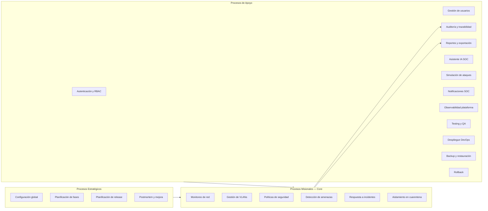

# Clasificación de procesos — NetGuard SOC (MyMonitoreo)

Clasificación de los procesos identificados en el sistema según su naturaleza organizacional, basada exclusivamente en la documentación de `documentacion/`.

**Criterios aplicados:**

| Tipo | Definición (según documentación del proyecto) |
|------|-----------------------------------------------|
| **Estratégico** | Dirección, planificación, configuración global y toma de decisiones sobre el sistema y su evolución |
| **Misional (Core)** | Razón de ser del software: monitoreo de red, ciberseguridad, detección, segmentación VLAN y respuesta a incidentes SOC/NOC |
| **Apoyo** | Soporta el funcionamiento de los procesos misionales sin constituir la función principal del producto |

---

## Mapa visual de clasificación

---

## Tabla resumen de clasificación

| # | Proceso | Tipo | Dominio / Fase |
|---|---------|------|----------------|
| 1 | Configuración global del sistema | Estratégico | Users / MP1 |
| 2 | Planificación por fases del proyecto | Estratégico | Transversal |
| 3 | Planificación y release v1.0.0 | Estratégico | Transversal |
| 4 | Postmortem y mejora continua | Estratégico | IncidentResponse |
| 5 | Monitoreo de red e infraestructura | Misional | NetworkMonitoring / Fase 2 |
| 6 | Visualización de dashboard SOC (KPIs) | Misional | NetworkMonitoring / Fase 2 |
| 7 | Inventario y estado de dispositivos | Misional | NetworkMonitoring / Fase 2 |
| 8 | Mapa de topología de red | Misional | NetworkMonitoring / Fase 2 |
| 9 | Gestión de VLANs activas | Misional | VLANManagement / Fase 3 |
| 10 | Gestión de políticas de seguridad | Misional | SecurityPolicies / Fase 4 |
| 11 | Evaluación de reglas (motor de reglas) | Misional | SecurityPolicies / Fase 4 |
| 12 | Detección y centro de alertas | Misional | ThreatDetection / Fase 5 |
| 13 | Clasificación de incidentes | Misional | IncidentResponse |
| 14 | Contención de amenazas | Misional | IncidentResponse |
| 15 | Aislamiento en VLAN de cuarentena | Misional | Quarantine / Fase 3 |
| 16 | Recuperación post-incidente | Misional | IncidentResponse |
| 17 | Autenticación y sesión | Apoyo | Auth / Fase 1 |
| 18 | Autorización RBAC por roles | Apoyo | Auth / Fase 1 |
| 19 | Gestión de perfil de usuario | Apoyo | Users / Fase 1 |
| 20 | Recuperación de contraseña | Apoyo | Auth / Fase 1 |
| 21 | Registro de auditoría (audit trail) | Apoyo | AuditLogs / Fase 5 |
| 22 | Consulta de logs y auditoría | Apoyo | AuditLogs / Fase 5 |
| 23 | Exportación de reportes | Apoyo | AuditLogs / Fase 5 |
| 24 | Centro de notificaciones | Apoyo | ThreatDetection / Fase 5 |
| 25 | Asistencia inteligente SOC (IA) | Apoyo | SOC_AI_Assistant / Fase 6 |
| 26 | Simulación de ataques (laboratorio) | Apoyo | ThreatDetection |
| 27 | Observabilidad de la plataforma | Apoyo | Infraestructura |
| 28 | Pruebas unitarias y CI | Apoyo | Fase 7 |
| 29 | Análisis estático SonarQube | Apoyo | Fase 7 |
| 30 | Despliegue (dev/staging/prod) | Apoyo | Fase 8 |
| 31 | Backup y restauración de datos | Apoyo | Infraestructura |
| 32 | Rollback de versiones | Apoyo | Fase 8 |

---

## Procesos estratégicos

### 1. Configuración global del sistema

| Atributo | Detalle |
|----------|---------|
| **Tipo** | Estratégico |
| **Descripción** | Definición de parámetros globales: umbrales de alertas, retención de logs, preferencias de notificaciones y activación/desactivación de funciones (p. ej. IA SOC, futuro). Ruta `/configuracion`, exclusiva de administrador. |
| **Justificación** | Es un proceso de **dirección y toma de decisiones** sobre cómo opera el sistema en su conjunto. No ejecuta monitoreo ni respuesta directa; establece las reglas operativas que condicionan todos los procesos misionales. Documentado en `manualdeusuario.md` §7 como función exclusiva del administrador. |

### 2. Planificación por fases del proyecto

| Atributo | Detalle |
|----------|---------|
| **Tipo** | Estratégico |
| **Descripción** | Roadmap incremental en 8 fases (seguridad → dashboard → VLANs → políticas → alertas → IA → testing → DevOps) con dependencias, criterios de cierre y bitácoras de avance. |
| **Justificación** | Proceso de **planificación y dirección** del desarrollo y evolución del producto. Define qué capacidades se construyen, en qué orden y cuándo se considera cerrada una fase. Documentado en `fases.md` y `README.md`. |

### 3. Planificación y release v1.0.0

| Atributo | Detalle |
|----------|---------|
| **Tipo** | Estratégico |
| **Descripción** | Definición de alcance, cronograma, checklist, versionado semver y comunicación para la primera versión estable del producto. |
| **Justificación** | Es **toma de decisiones estratégicas** sobre qué incluir/excluir en una versión, cuándo liberar y a quién comunicar. No es operación SOC diaria sino gobernanza del producto. Documentado en `implementacion/release-plan-v1.0.0.md`. |

### 4. Postmortem y mejora continua

| Atributo | Detalle |
|----------|---------|
| **Tipo** | Estratégico |
| **Descripción** | Documentación tras incidentes mayores: línea de tiempo, root cause, lecciones aprendidas y acciones preventivas (nueva política, segmentación). |
| **Justificación** | Proceso de **análisis y decisión** orientado a mejorar la postura de seguridad y los procedimientos futuros, no a la respuesta inmediata al incidente. Documentado en `incident_response.md` §8 y `informe_final.md`. |

---

## Procesos misionales (Core)

### 5. Monitoreo de red e infraestructura

| Atributo | Detalle |
|----------|---------|
| **Tipo** | Misional (Core) |
| **Descripción** | Observación continua del estado de la red: telemetría, estados de dispositivos y correlación con eventos de seguridad. |
| **Justificación** | Es la **función principal** del producto según `README.md`: *"monitoreo de red"*. Sin este proceso no existe valor operativo para el SOC/NOC. Dominio central en DDD (`reglas/ddd.md` — núcleo operativo). |

### 6. Visualización de dashboard SOC (KPIs)

| Atributo | Detalle |
|----------|---------|
| **Tipo** | Misional (Core) |
| **Descripción** | Consolidación de indicadores (dispositivos online, alertas activas, VLANs, incidentes) con gráficos de actividad y accesos rápidos a alertas críticas. |
| **Justificación** | Punto de control principal del turno SOC documentado en `manualdeusuario.md` §2. Materializa la visibilidad unificada que el proyecto busca resolver (`informe_final.md` §1). |

### 7. Inventario y estado de dispositivos

| Atributo | Detalle |
|----------|---------|
| **Tipo** | Misional (Core) |
| **Descripción** | Listado de hosts con IP, MAC, VLAN y estado (online, offline, degradado, cuarentena) con filtros y detalle de conectividad. |
| **Justificación** | Resuelve la *"visibilidad fragmentada de dispositivos"* identificada como problema en `informe_final.md`. Parte esencial del monitoreo de red. |

### 8. Mapa de topología de red

| Atributo | Detalle |
|----------|---------|
| **Tipo** | Misional (Core) |
| **Descripción** | Visualización de nodos y enlaces de la infraestructura de red. |
| **Justificación** | Complemento directo del monitoreo de infraestructura; permite comprender relaciones y puntos de fallo. Documentado como módulo de Fase 2 y ruta `/topologia`. |

### 9. Gestión de VLANs activas

| Atributo | Detalle |
|----------|---------|
| **Tipo** | Misional (Core) |
| **Descripción** | Consulta y gestión de segmentos VLAN (ID, nombre, subred, dispositivos, estados). |
| **Justificación** | La **segmentación VLAN** es eje del proyecto (*"segmentación VLAN"* en título e `informe_final.md`). Dominio `VLANManagement` en núcleo de contención DDD. |

### 10. Gestión de políticas de seguridad

| Atributo | Detalle |
|----------|---------|
| **Tipo** | Misional (Core) |
| **Descripción** | CRUD de reglas (origen, destino, puertos, umbral), severidad y acciones (alertar, auditar, cuarentena automática). |
| **Justificación** | Define **cómo se detectan y responden** las amenazas. Parte del núcleo operativo DDD junto a ThreatDetection. Documentado en Fase 4 y `manualdeusuario.md` §6. |

### 11. Evaluación de reglas (motor de reglas)

| Atributo | Detalle |
|----------|---------|
| **Tipo** | Misional (Core) |
| **Descripción** | Matching de tráfico, logs y telemetría contra políticas; generación de alertas con severidad y disparo de acciones. |
| **Justificación** | Mecanismo central de **detección de intrusos** documentado en `arquitectura.md`. Conecta políticas con alertas en el flujo operativo transversal. |

### 12. Detección y centro de alertas

| Atributo | Detalle |
|----------|---------|
| **Tipo** | Misional (Core) |
| **Descripción** | Recepción, clasificación por severidad y gestión de alertas (reconocer, escalar, iniciar contención). |
| **Justificación** | **Detección de intrusos** es función explícita del producto (`README.md`). El centro de alertas es la vista principal de seguridad para el operador (`monitoring.md`). |

### 13. Clasificación de incidentes

| Atributo | Detalle |
|----------|---------|
| **Tipo** | Misional (Core) |
| **Descripción** | Asignación de severidad (crítica, alta, media, baja) con SLAs orientativos según criterios documentados. |
| **Justificación** | Paso obligatorio del ciclo de respuesta a incidentes (`incident_response.md` §2). Determina prioridad operativa del SOC. |

### 14. Contención de amenazas

| Atributo | Detalle |
|----------|---------|
| **Tipo** | Misional (Core) |
| **Descripción** | Acciones inmediatas para limitar propagación: bloqueo temporal, deshabilitación de cuentas, aumento de logging, notificación al responsable de red. |
| **Justificación** | Fase central del ciclo de **respuesta a incidentes** documentado. Objetivo explícito: reducir *"tiempos de respuesta lentos ante intrusiones"* (`informe_final.md`). |

### 15. Aislamiento en VLAN de cuarentena

| Atributo | Detalle |
|----------|---------|
| **Tipo** | Misional (Core) |
| **Descripción** | Aislamiento de hosts comprometidos o sospechosos en VLAN dedicada, con confirmación, verificación y posterior liberación. |
| **Justificación** | Capacidad distintiva del producto: *"aislamiento en VLAN de cuarentena"*. Principio arquitectónico *"fail-safe en cuarentena"* (`arquitectura.md`). Dominio `Quarantine` en DDD. |

### 16. Recuperación post-incidente

| Atributo | Detalle |
|----------|---------|
| **Tipo** | Misional (Core) |
| **Descripción** | Erradicación de causa, liberación de cuarentena, restauración de VLAN de producción y monitoreo reforzado 24–72 h. |
| **Justificación** | Cierra el ciclo misional de respuesta a incidentes (`incident_response.md` §7). Sin recuperación, el aislamiento no cumple su propósito operativo. |

---

## Procesos de apoyo

### 17. Autenticación y sesión

| Atributo | Detalle |
|----------|---------|
| **Tipo** | Apoyo |
| **Descripción** | Login, logout, persistencia de sesión e interceptor de token JWT. |
| **Justificación** | **Habilita** el acceso a funciones SOC pero no es la razón de ser del producto. Documentado como Fase 1 de infraestructura de acceso. |

### 18. Autorización RBAC por roles

| Atributo | Detalle |
|----------|---------|
| **Tipo** | Apoyo |
| **Descripción** | Control de acceso por roles (`admin`, `operador`, `analista`) con guards en rutas sensibles. |
| **Justificación** | Mecanismo de **seguridad de la plataforma** que soporta procesos misionales sin ser operación SOC en sí. Matriz de roles en `incident_response.md` y `reglas/seguridad.md`. |

### 19. Gestión de perfil de usuario

| Atributo | Detalle |
|----------|---------|
| **Tipo** | Apoyo |
| **Descripción** | Actualización de nombre, preferencias y consulta de rol asignado en `/perfil`. |
| **Justificación** | Gestión de identidad del operador; **soporta** la experiencia de uso sin aportar capacidades de monitoreo o seguridad de red. |

### 20. Recuperación de contraseña

| Atributo | Detalle |
|----------|---------|
| **Tipo** | Apoyo |
| **Descripción** | Flujo de recuperación de acceso en `/recuperar-password`. |
| **Justificación** | Procedimiento de **soporte al acceso**; no participa en operaciones SOC de monitoreo o respuesta. |

### 21. Registro de auditoría (audit trail)

| Atributo | Detalle |
|----------|---------|
| **Tipo** | Apoyo |
| **Descripción** | Registro automático append-only de acciones críticas (login, cambios VLAN, aislamientos, violaciones de política). |
| **Justificación** | **Trazabilidad** que soporta compliance y postmortem, pero no ejecuta monitoreo ni respuesta. Principio arquitectónico de soporte (`arquitectura.md`). |

### 22. Consulta de logs y auditoría

| Atributo | Detalle |
|----------|---------|
| **Tipo** | Apoyo |
| **Descripción** | Timeline de eventos de autenticación, red, seguridad y administración en `/auditoria`. |
| **Justificación** | Herramienta de **consulta y análisis** para analistas; complementa procesos misionales sin ser detección ni respuesta activa. |

### 23. Exportación de reportes

| Atributo | Detalle |
|----------|---------|
| **Tipo** | Apoyo |
| **Descripción** | Exportación de alertas, auditoría e inventario en CSV/JSON desde `/reportes`. |
| **Justificación** | Genera **evidencia exportable** para compliance; proceso de soporte documentado en Fase 5. |

### 24. Centro de notificaciones

| Atributo | Detalle |
|----------|---------|
| **Tipo** | Apoyo |
| **Descripción** | Notificaciones en barra superior ante nuevas alertas y eventos relevantes. |
| **Justificación** | **Canal de entrega** de alertas misionales; no detecta ni responde por sí mismo. Servicio `notification-center.service` en Fase 5. |

### 25. Asistencia inteligente SOC (IA)

| Atributo | Detalle |
|----------|---------|
| **Tipo** | Apoyo |
| **Descripción** | Panel flotante con resúmenes, sugerencias de contención y explicación de políticas. Sin ejecución autónoma de aislamiento. |
| **Justificación** | Clasificado explícitamente como dominio de **soporte** en DDD (`reglas/ddd.md` — subgraph `support`). *"No reemplaza la decisión humana"* (`reglas/ia.md`). |

### 26. Simulación de ataques (laboratorio)

| Atributo | Detalle |
|----------|---------|
| **Tipo** | Apoyo |
| **Descripción** | Escenarios de ataque (port scan, brute force) para validar detección en entorno lab. |
| **Justificación** | **Valida** capacidades misionales de detección pero no es operación SOC productiva. Restringido a laboratorio con permiso `simulate` (`reglas/seguridad.md`). |

### 27. Observabilidad de la plataforma

| Atributo | Detalle |
|----------|---------|
| **Tipo** | Apoyo |
| **Descripción** | Uptime, logs de aplicación, métricas Prometheus y trazas OpenTelemetry del propio NetGuard SOC. |
| **Justificación** | Monitoreo de la **herramienta**, no de la red bajo protección SOC. Documentado en `monitoring.md` como pilar de observabilidad de infraestructura. |

### 28. Pruebas unitarias y CI

| Atributo | Detalle |
|----------|---------|
| **Tipo** | Apoyo |
| **Descripción** | Vitest, specs en dominios críticos y pipeline GitHub Actions (`npm run test:ci`). |
| **Justificación** | Asegura **calidad del software** que implementa procesos misionales; no es operación SOC. Fase 7 transversal. |

### 29. Análisis estático SonarQube

| Atributo | Detalle |
|----------|---------|
| **Tipo** | Apoyo |
| **Descripción** | Análisis de deuda técnica, vulnerabilidades y cobertura con proyecto `netguard-soc`. |
| **Justificación** | **Calidad de código** de soporte al desarrollo. Documentado en `monitoring.md` como no-runtime. |

### 30. Despliegue (dev/staging/prod)

| Atributo | Detalle |
|----------|---------|
| **Tipo** | Apoyo |
| **Descripción** | Estrategia de despliegue por entorno, Docker/nginx, variables de entorno y smoke tests. |
| **Justificación** | **Operaciones de plataforma** que ponen disponible el software SOC; no es función SOC en sí. Fase 8, sin dominio DDD de negocio (`avance_fase_8_produccion_devops.md`). |

### 31. Backup y restauración de datos

| Atributo | Detalle |
|----------|---------|
| **Tipo** | Apoyo |
| **Descripción** | Estrategia de respaldo de BD, configuración, logs y políticas; procedimiento de restauración. |
| **Justificación** | **Continuidad del negocio** y soporte a recuperación; plan mayormente futuro (`backup_restore.md`). |

### 32. Rollback de versiones

| Atributo | Detalle |
|----------|---------|
| **Tipo** | Apoyo |
| **Descripción** | Reversión a versión estable de frontend/API tras despliegue fallido o regresión. |
| **Justificación** | Procedimiento de **operaciones DevOps** de contingencia; no participa en detección ni respuesta SOC (`rollback.md`). |

---

## Resumen cuantitativo

| Tipo | Cantidad | Porcentaje |
|------|----------|------------|
| Estratégicos | 4 | 12,5 % |
| Misionales (Core) | 12 | 37,5 % |
| Apoyo | 16 | 50,0 % |
| **Total** | **32** | **100 %** |

---

## Relación con macroprocesos

| Macroproceso | Procesos incluidos (por tipo) |
|--------------|-------------------------------|
| MP1 — Gobierno | Estratégicos: 1, 2, 3 |
| MP2 — Monitoreo | Misionales: 5, 6, 7, 8 |
| MP3 — VLANs | Misional: 9 |
| MP4 — Detección | Misionales: 10, 11, 12; Apoyo: 24 |
| MP5 — Incidentes | Misionales: 13, 14, 15, 16; Estratégico: 4 |
| MP6 — Identidad | Apoyo: 17, 18, 19, 20 |
| MP7 — Auditoría | Apoyo: 21, 22, 23 |
| MP8 — IA SOC | Apoyo: 25 |
| MP9 — Simulación | Apoyo: 26 |
| MP10 — Observabilidad | Apoyo: 27 |
| MP11 — Calidad | Apoyo: 28, 29 |
| MP12 — DevOps | Apoyo: 30, 31, 32 |

---

## Referencias

- Macroprocesos detallados: [macroprocesos.md](./macroprocesos.md)
- Dominios DDD: [../reglas/ddd.md](../reglas/ddd.md)
- Flujo operativo: [../incident_response.md](../incident_response.md)
- Índice documentación: [../README.md](../README.md)
