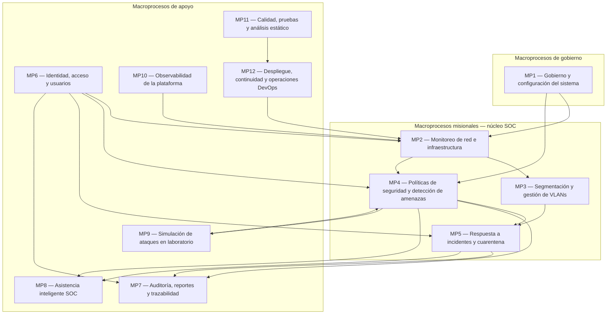
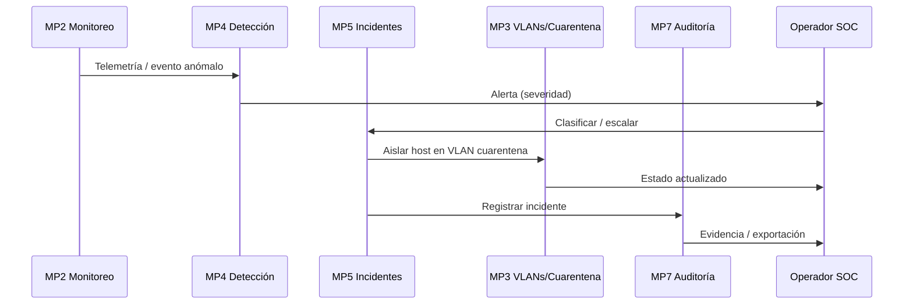

# Macroprocesos — NetGuard SOC (MyMonitoreo)

Documento derivado exclusivamente de la documentación en `documentacion/`. Describe los macroprocesos del sistema de **monitoreo de red, segmentación VLAN, detección de intrusos y operaciones SOC/NOC** según su funcionalidad documentada.

> **Alcance documentado:** El frontend Angular 21 está implementado con datos mock; backend Node.js, WebSockets productivos, GNS3/VMware y persistencia en BD están planificados como evolución futura. Este mapa refleja ambos estados cuando la documentación los distingue explícitamente.

---

## Mapa de macroprocesos



---

## Flujo operativo transversal (documentado)

Según `avances/resumen_reglas_sistema_monitoreo_vlan.md` e `incident_response.md`:

```
Monitoreo → Alerta → Política → Incidente → Cuarentena → Auditoría → Recuperación
```



---

## Detalle de macroprocesos

### MP1 — Gobierno y configuración del sistema

| Atributo | Descripción |
|----------|-------------|
| **Descripción** | Define parámetros globales, planificación de evolución del producto y criterios de cierre de versiones. Incluye la página de **Configuración** (`/configuracion`), el roadmap por fases y el plan de release v1.0.0. |
| **Dominios DDD** | Users (configuración), transversal a todos los dominios |
| **Entradas** | Requisitos de negocio y operación SOC; parámetros de umbrales, retención de logs y preferencias de notificaciones; cronograma de fases y checklist de release |
| **Salidas** | Configuración activa del sistema; roadmap documentado; criterios de cierre v1.0.0; comunicación a equipos SOC, docentes y DevOps |
| **Responsables** | **Administrador** (configuración operativa); **equipo de desarrollo** (planificación de fases y releases, según `fases.md` y `release-plan-v1.0.0.md`) |
| **Estado documentado** | Configuración UI implementada (admin); planificación documentada en `fases.md`, `deployment.md` e `implementacion/release-plan-v1.0.0.md` |
| **Referencias** | `manualdeusuario.md` §7, `fases.md`, `deployment.md`, `implementacion/release-plan-v1.0.0.md` |

---

### MP2 — Monitoreo de red e infraestructura

| Atributo | Descripción |
|----------|-------------|
| **Descripción** | Visualización unificada del estado de la red: dashboard SOC con KPIs, inventario de dispositivos, mapa de topología y métricas de telemetría. Constituye el primer punto de control del turno NOC/SOC. |
| **Dominios DDD** | NetworkMonitoring |
| **Entradas** | Datos de dispositivos (IP, MAC, VLAN, estado); telemetría de red; eventos de cambio de topología (mock actual; GNS3/VMware futuro); alertas activas para KPIs |
| **Salidas** | Dashboard con KPIs (dispositivos online, alertas, VLANs, incidentes); listado filtrable de dispositivos; mapa de nodos y enlaces; estados: online, offline, degradado, cuarentena |
| **Responsables** | **Operador SOC** y **Analista SOC** (consulta y monitoreo); **Administrador** (umbrales en configuración) |
| **Estado documentado** | Implementado con `mock-network.service` y fachada `network-api.service`; integración GNS3/VMware y WebSocket de KPIs planificados |
| **Referencias** | `manualdeusuario.md` §2, §3, §12; `avance_fase_2_dashboard_monitoreo.md`; `arquitectura.md`; `monitoring.md` |

---

### MP3 — Segmentación y gestión de VLANs

| Atributo | Descripción |
|----------|-------------|
| **Descripción** | Consulta y gestión lógica de VLANs activas (802.1Q en UI/lab): ID, nombre, subred, dispositivos asociados y estados (activa, degradada, mantenimiento, cuarentena). |
| **Dominios DDD** | VLANManagement |
| **Entradas** | Configuración de segmentos VLAN; inventario de dispositivos por segmento; eventos de degradación o mantenimiento |
| **Salidas** | Listado de VLANs configuradas; dispositivos por segmento; estado operativo de cada VLAN |
| **Responsables** | **Operador SOC** y **Administrador** (consulta y gestión); **Analista SOC** (lectura) |
| **Estado documentado** | Página `/vlans` implementada; creación/edición vía API y sincronización GNS3 planificados |
| **Referencias** | `manualdeusuario.md` §4; `avance_fase_3_vlans_cuarentena.md`; `reglas/ddd.md`; `monitoring.md` |

---

### MP4 — Políticas de seguridad y detección de amenazas

| Atributo | Descripción |
|----------|-------------|
| **Descripción** | Definición de reglas de seguridad (origen, destino, puertos, umbral), evaluación contra tráfico/logs/telemetría y generación de alertas con severidad. Incluye el **Centro de alertas** y el motor de reglas (simplificado en frontend; completo en backend futuro). |
| **Dominios DDD** | SecurityPolicies, ThreatDetection |
| **Entradas** | Políticas y reglas configuradas; eventos de red anómalos; tráfico, logs y telemetría; resultados de simulación de ataques (lab); violaciones de política |
| **Salidas** | Alertas clasificadas por severidad (crítica, alta, media, baja); notificaciones en centro de notificaciones; acciones automáticas documentadas: alertar, auditar, cuarentena automática (si `autoQuarantine` activo) |
| **Responsables** | **Administrador** y **Operador SOC** (definición y gestión de políticas); **Operador SOC** y **Analista SOC** (revisión y acción sobre alertas) |
| **Estado documentado** | UI de políticas y centro de alertas implementados; motor de reglas en Node.js y WebSocket `alert.created` planificados |
| **Referencias** | `manualdeusuario.md` §5, §6; `arquitectura.md`; `avance_fase_4_politicas_seguridad.md`; `avance_fase_5_alertas_logs.md`; `reglas/seguridad.md` |

---

### MP5 — Respuesta a incidentes y cuarentena

| Atributo | Descripción |
|----------|-------------|
| **Descripción** | Ciclo completo de manejo de intrusiones y amenazas: detectar, clasificar, contener, aislar en VLAN de cuarentena, registrar, notificar, recuperar y postmortem. Incluye la página **VLAN de cuarentena** (`/vlan-cuarentena`). |
| **Dominios DDD** | IncidentResponse, Quarantine |
| **Entradas** | Alertas del centro de alertas; confirmación del operador; host identificado (IP/MAC); clasificación de severidad; acciones de contención |
| **Salidas** | Host aislado en VLAN cuarentena; host liberado tras remediación; registro de incidente; notificaciones al equipo SOC; línea de tiempo para postmortem |
| **Responsables** | **Operador SOC** y **Administrador** (aislar/liberar cuarentena); **Analista SOC** (ver alertas, sin aislar); todos los roles en postmortem |
| **Estado documentado** | Flujo UI con confirmación y auditoría parcial implementado; aislamiento simulado en mock; API `POST /quarantine/isolate` y cambio en switch GNS3 planificados |
| **Referencias** | `incident_response.md`; `manualdeusuario.md` §9; `avance_fase_3_vlans_cuarentena.md`; `reglas/seguridad.md` |

---

### MP6 — Identidad, acceso y usuarios

| Atributo | Descripción |
|----------|-------------|
| **Descripción** | Autenticación, autorización RBAC, gestión de sesión y perfil de usuario. Controla el acceso a rutas sensibles mediante guards e interceptor de token. |
| **Dominios DDD** | Auth, Users |
| **Entradas** | Credenciales de usuario; solicitud de recuperación de contraseña; token JWT (futuro backend); rol asignado (`admin`, `operador`, `analista`) |
| **Salidas** | Sesión autenticada; redirección al dashboard; acceso denegado/permitido según rol; perfil de usuario actualizado |
| **Responsables** | **Administrador** (gestión de roles y acceso); **todos los usuarios** (login, perfil, logout) |
| **Estado documentado** | Auth mock con localStorage, guards e interceptor implementados; JWT httpOnly y refresh token planificados |
| **Referencias** | `manualdeusuario.md` §1, §14; `avance_fase_1_seguridad_acceso.md`; `reglas/seguridad.md`; `incident_response.md` (matriz de roles) |

---

### MP7 — Auditoría, reportes y trazabilidad

| Atributo | Descripción |
|----------|-------------|
| **Descripción** | Registro append-only de acciones críticas (autenticación, red, seguridad, administración) y exportación de evidencias para compliance. Principio arquitectónico: **auditoría obligatoria** en acciones críticas. |
| **Dominios DDD** | AuditLogs |
| **Entradas** | Eventos de login/logout; cambios de VLAN; aislamientos y liberaciones; violaciones de política; simulaciones de ataque; cambios de configuración |
| **Salidas** | Timeline de auditoría en UI; exportación CSV/JSON desde reportes; evidencia para postmortem y compliance |
| **Responsables** | **Analista SOC** (consulta y análisis); **Administrador** y **Operador SOC** (generación indirecta al ejecutar acciones); exportación disponible según rol |
| **Estado documentado** | `audit-trail.service`, páginas `/auditoria` y `/reportes` implementadas; persistencia append-only en BD planificada |
| **Referencias** | `manualdeusuario.md` §8, §13; `avance_fase_5_alertas_logs.md`; `arquitectura.md`; `monitoring.md` |

---

### MP8 — Asistencia inteligente SOC

| Atributo | Descripción |
|----------|-------------|
| **Descripción** | Copiloto para analistas y operadores: resumen de alertas, sugerencias de contención, explicación de políticas violadas y borrador de postmortem (futuro). **No ejecuta aislamiento ni cambios de política sin confirmación humana.** |
| **Dominios DDD** | SOC_AI_Assistant |
| **Entradas** | Consultas del operador; contexto de alertas activas, VLANs y políticas (mock actual; datos en vivo vía API futuro) |
| **Salidas** | Respuestas contextuales; recomendaciones de respuesta; disclaimer de verificación humana |
| **Responsables** | **Operador SOC**, **Analista SOC** y **Administrador** (consulta); **Administrador** (activar/desactivar IA en configuración, futuro) |
| **Estado documentado** | Panel flotante con respuestas basadas en plantillas implementado; LLM/RAG y endpoint `/api/v1/soc-ai/chat` planificados |
| **Referencias** | `manualdeusuario.md` §10; `avance_fase_6_asistente_ia_soc.md`; `reglas/ia.md`; `arquitectura.md` |

---

### MP9 — Simulación de ataques en laboratorio

| Atributo | Descripción |
|----------|-------------|
| **Descripción** | Ejecución de escenarios de ataque (port scan, brute force, etc.) en entorno de laboratorio para validar detección, alertas y flujos de respuesta. Solo con permiso `simulate` y banner de entorno lab. |
| **Dominios DDD** | ThreatDetection |
| **Entradas** | Escenario de ataque seleccionado; autorización de rol; entorno de laboratorio (GNS3 futuro) |
| **Salidas** | Eventos de ataque simulados; alertas generadas; validación del flujo detección → respuesta |
| **Responsables** | **Administrador**, **Operador SOC** y **Analista SOC** (según permiso `simulate` en `PERMISOS_POR_ROL`) |
| **Estado documentado** | Página `/simulacion-ataques` implementada; integración GNS3 planificada; deshabilitación en build producción documentada como objetivo |
| **Referencias** | `manualdeusuario.md` §11; `incident_response.md`; `reglas/seguridad.md`; `implementacion/integracion_gns3.md` |

---

### MP10 — Observabilidad de la plataforma

| Atributo | Descripción |
|----------|-------------|
| **Descripción** | Monitoreo de disponibilidad, logs, métricas y trazas del propio sistema NetGuard SOC (uptime, salud API, métricas Prometheus, trazas OpenTelemetry). Distinto del monitoreo de red SOC (MP2). |
| **Dominios DDD** | Transversal (infraestructura) |
| **Entradas** | Health checks HTTP/API; logs de aplicación e infraestructura; métricas de runtime |
| **Salidas** | Indicadores de uptime; logs estructurados; métricas expuestas (`/metrics` futuro); alertas operativas (API caída, disco lleno) |
| **Responsables** | **Equipo DevOps / desarrollo** (configuración y monitoreo de plataforma); **Administrador** (retención y umbrales) |
| **Estado documentado** | Parcial: CI GitHub Actions, UI de auditoría; APM, Prometheus y OpenTelemetry planificados |
| **Referencias** | `monitoring.md`; `deployment.md`; `implementacion/websocket-events.md` |

---

### MP11 — Calidad, pruebas y análisis estático

| Atributo | Descripción |
|----------|-------------|
| **Descripción** | Aseguramiento de calidad del software: pruebas unitarias Vitest, pipeline CI, cobertura y análisis SonarQube. Prioridad documentada en dominios Auth, Quarantine y Policies. |
| **Dominios DDD** | Transversal (no dominio de negocio) |
| **Entradas** | Código fuente; specs `*.spec.ts`; configuración `sonar-project.properties`; workflow CI |
| **Salidas** | Resultados de tests; informes de cobertura; análisis SonarQube `netguard-soc`; gate de merge (`npm run test:ci`) |
| **Responsables** | **Equipo de desarrollo**; validación obligatoria antes de merge según `reglas/testing.md` |
| **Estado documentado** | Vitest, CI y SonarQube configurados; cobertura ≥ 70% en dominios críticos pendiente |
| **Referencias** | `avance_fase_7_testing_qa.md`; `reglas/testing.md`; `implementacion/integracion_sonarqube.md`; `deployment.md` (checklist pre-producción) |

---

### MP12 — Despliegue, continuidad y operaciones DevOps

| Atributo | Descripción |
|----------|-------------|
| **Descripción** | Ciclo de vida de despliegue en entornos dev/staging/producción, empaquetado Docker/nginx, rollback ante fallos y estrategia de backup/restauración de datos. |
| **Dominios DDD** | Infraestructura (sin dominio DDD de negocio) |
| **Entradas** | Artefactos de build Angular; imagen Docker; variables de entorno (`API_URL`, `WS_URL`); checklist pre-producción; plan de backup |
| **Salidas** | Aplicación desplegada por entorno; imagen versionada (`netguard-soc-frontend:MAJOR.MINOR.PATCH`); procedimiento de rollback; respaldos de BD y configuración (futuro) |
| **Responsables** | **Equipo DevOps / desarrollo** (despliegue y rollback); **Administrador** (validación operativa post-deploy) |
| **Estado documentado** | Dockerfile y documentación parcial; docker-compose con API y backup automatizado planificados |
| **Referencias** | `deployment.md`; `manual-despliegue-docker.md`; `manual-despliegue-hosting-compartido.md`; `rollback.md`; `backup_restore.md`; `avance_fase_8_produccion_devops.md` |

---

## Matriz de interrelaciones entre macroprocesos

| Macroproceso | Alimenta a | Depende de |
|--------------|------------|------------|
| MP1 Gobierno | MP2, MP4, MP10 | — |
| MP2 Monitoreo | MP4, MP3 | MP6, MP12 |
| MP3 VLANs | MP5 | MP2 |
| MP4 Detección | MP5, MP7, MP8 | MP2, MP3, MP6, MP9 |
| MP5 Incidentes | MP7, MP3 | MP4, MP3, MP6 |
| MP6 Identidad | MP2, MP4, MP5, MP7 | MP12 |
| MP7 Auditoría | — (destino final) | MP4, MP5, MP6, MP8, MP9 |
| MP8 Asistente IA | — (apoyo consultivo) | MP4, MP5, MP7 |
| MP9 Simulación | MP4 | MP6 |
| MP10 Observabilidad | MP2, MP12 | MP12 |
| MP11 Calidad | MP12 | — |
| MP12 DevOps | MP2, MP6, MP10 | MP11 |

---

## Correspondencia con dominios DDD (10 contextos)

| Dominio DDD | Macroproceso principal |
|-------------|------------------------|
| Auth | MP6 |
| Users | MP6, MP1 |
| NetworkMonitoring | MP2 |
| VLANManagement | MP3 |
| SecurityPolicies | MP4 |
| ThreatDetection | MP4, MP9 |
| IncidentResponse | MP5 |
| Quarantine | MP5 |
| AuditLogs | MP7 |
| SOC_AI_Assistant | MP8 |

---

## Correspondencia con fases de desarrollo

| Fase | Macroprocesos principales |
|------|---------------------------|
| 1 — Seguridad y acceso | MP6 |
| 2 — Dashboard y monitoreo | MP2 |
| 3 — VLANs y cuarentena | MP3, MP5 |
| 4 — Políticas de seguridad | MP4 |
| 5 — Alertas y logs | MP4, MP7 |
| 6 — Asistente IA SOC | MP8 |
| 7 — Testing y SonarQube | MP11 |
| 8 — Producción y DevOps | MP12, MP10 |

---

## Referencias

- Índice general: [../README.md](../README.md)
- Arquitectura: [../arquitectura.md](../arquitectura.md)
- Dominios DDD: [../reglas/ddd.md](../reglas/ddd.md)
- Clasificación de procesos: [clasificacion_procesos.md](./clasificacion_procesos.md)
