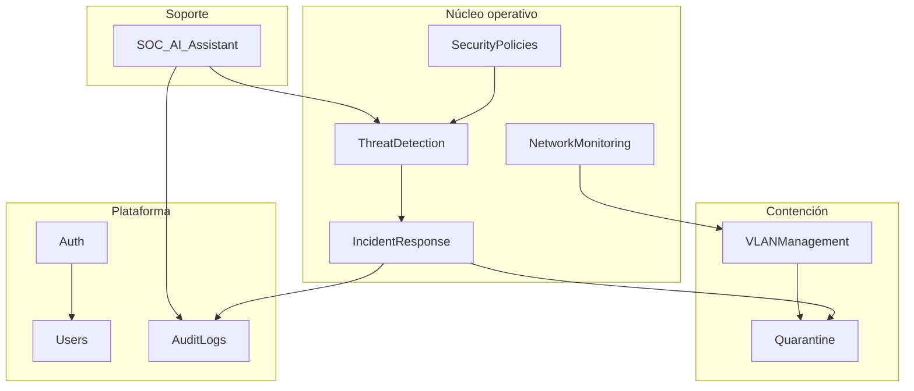

# Domain-Driven Design — NetGuard SOC

---

## Contextos delimitados

---

## Dominios

### Auth
- Login, logout, refresh, recuperación contraseña
- Entidades: `Credenciales`, `Sesion`, `TokenClaims`

### Users
- Perfil, preferencias UX, actividad
- Entidades: `Usuario`, `Rol`, `Permiso`

### NetworkMonitoring
- Dispositivos, topología, KPIs, telemetría
- Entidades: `Dispositivo`, `Enlace`, `MetricaRed`

### VLANManagement
- Segmentación 802.1Q lógica en UI/lab
- Entidades: `Vlan`, `Subred`, `MiembroVlan`

### SecurityPolicies
- Reglas y acciones
- Entidades: `Politica`, `Regla`, `AccionPolitica`

### ThreatDetection
- Alertas, correlación, simulación
- Entidades: `Alerta`, `Firma`, `SimulacionAtaque`

### IncidentResponse
- Ciclo de vida del incidente
- Entidades: `Incidente`, `Clasificacion`, `AccionRespuesta`

### Quarantine
- Aislamiento en VLAN dedicada
- Entidades: `HostEnCuarentena`, `MotivoAislamiento`

### AuditLogs
- Trazabilidad inmutable (append-only en futuro BD)
- Entidades: `EntradaAuditoria`, `Actor`, `Recurso`

### SOC_AI_Assistant
- Conversación contextual SOC
- Entidades: `ConsultaSoc`, `Recomendacion`

---

## Ubicación en el código (Angular actual)

| Dominio | `core/models/` | `core/services/` | `pages/` |
|---------|----------------|------------------|----------|
| Auth | `usuario.model` | `auth.service` | `login` |
| Users | `ux.models` | `user-profile.service` | `perfil` |
| NetworkMonitoring | `network.models`, `dispositivo.model` | `mock-network.service` | `vision-general`, `dispositivos`, `topologia` |
| VLANManagement | en `network.models` | mock/network-api | `vlans` |
| SecurityPolicies | `policy.models` | `security-policy.service` | `politicas` |
| ThreatDetection | `alerta.model`, `attack.models` | `attack-simulation.service` | `alertas`, `simulacion-ataques` |
| Quarantine | — | vía network/mock | `vlan-cuarentena` |
| AuditLogs | `audit.models` | `audit-trail.service` | `auditoria`, `reportes` |
| IncidentResponse | — | `soc-event.service` | transversal |
| SOC_AI_Assistant | — | `soc-ai.service` | componente shared |

---

## Anti-patrones

- Modelo `Dispositivo` con métodos de política y cuarentena mezclados
- Página que llama a 5 servicios de dominios distintos sin orquestador
- Duplicar enums de severidad en cada feature (centralizar)

---

## Eventos de dominio (futuro)

| Evento | Productor | Consumidor |
|--------|-----------|------------|
| `AlertCreated` | ThreatDetection | IncidentResponse, UI WS |
| `HostIsolated` | Quarantine | AuditLogs, NetworkMonitoring |
| `PolicyViolated` | SecurityPolicies | ThreatDetection |
| `UserLoggedIn` | Auth | AuditLogs |

---

## Agregados

| Agregado | Raíz |
|----------|------|
| Incidente | `Incidente` |
| Host en cuarentena | `HostEnCuarentena` |
| Política | `Politica` |
| VLAN | `Vlan` |

Modificar solo a través de la raíz del agregado.
